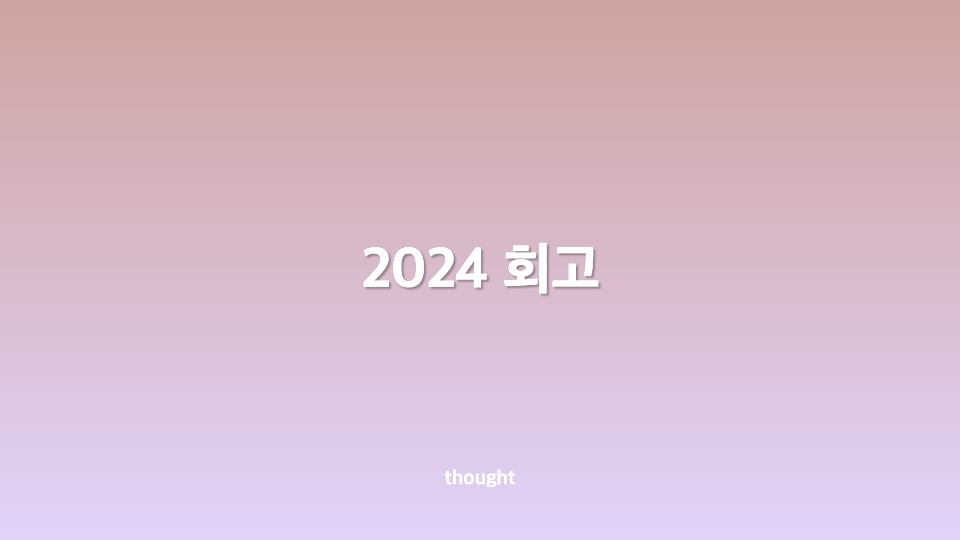
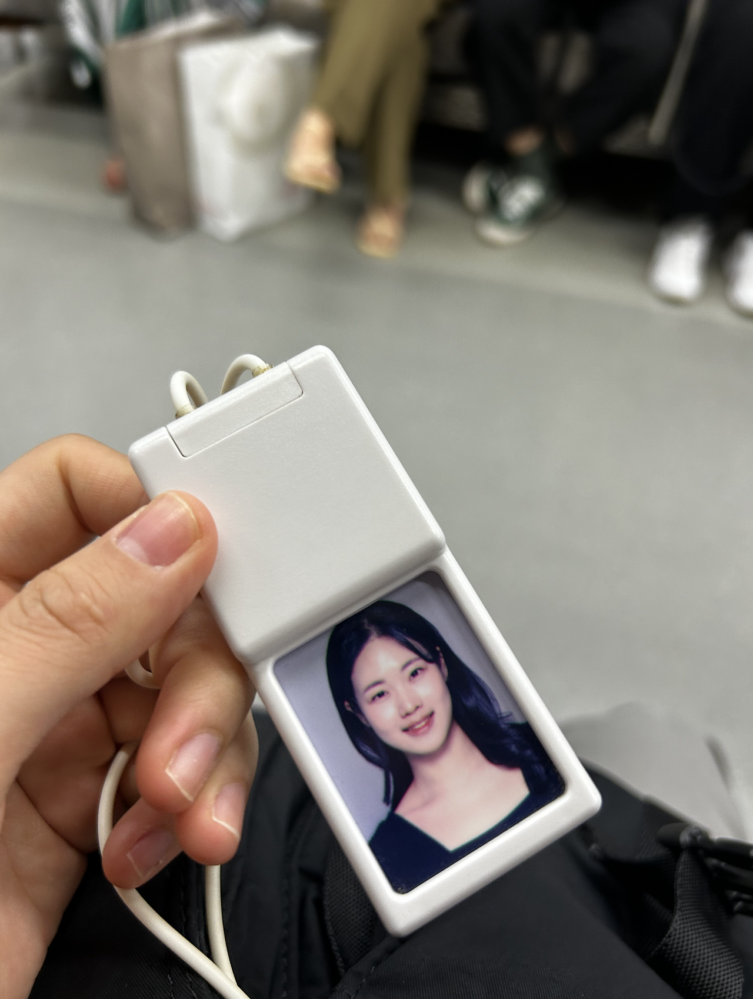
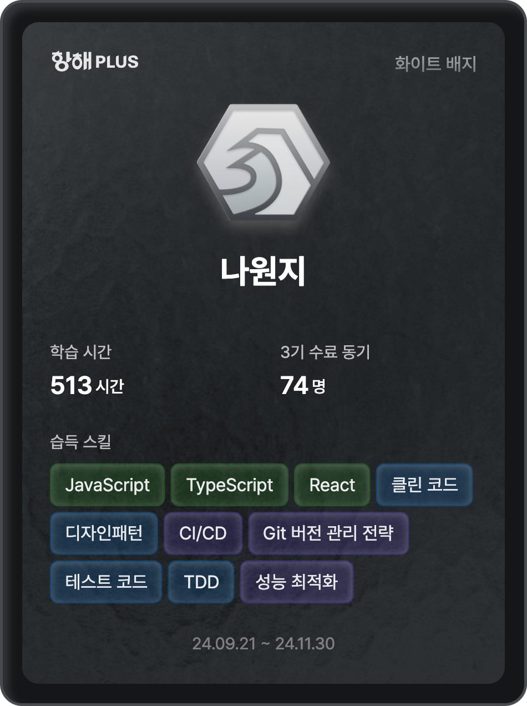

처음 개발자가 된 2021년도부터 지금까지의 변화를 회고해보았습니다.

<!-- truncate -->

## 프로젝트 오픈 연기, 그리고 지쳐가는 나

2023년 7월부터 시작한 프로젝트. 원래 2024년 2월 오픈 예정이었지만, 현실은 네 번의 연기 끝에 6월에 임시 오픈, 최종 오픈은 10월이었다.
생각보다 스트레스를 많이 받았다. 2023년 하반기는 정말 정신없이 지나갔고, 그래도 "24년 상반기에는 끝난다"는 희망만으로 버텼다.
그런데 계속된 연기로 인해 그 희망조차 무너졌고, 한동안은 무기력한 상태로 지냈다.

## 퇴사, 그리고 나를 돌아보는 시간

프로젝트 지연이 주된 이유는 아니었지만, 그것으로 인한 건강이상이 퇴사의 결정적인 계기가 되었다.
하루에도 이유 없이 눈물이 나는 날이 많아졌고, 직장인 4년 차가 되어가면서도 내 자신이 커리어에 애정이 있는건지 이 직업을 하고 있는 것에 대해 힘들었다.
처음엔 "돈이라도 벌어야지"라는 생각으로 버텼지만, 어느 순간 그것마저 의미 없게 느껴졌다.
지쳤다. 그리고 결국, 퇴사를 선택했다.

## 항해플러스 – 개발자로서의 방향성을 고민하다

퇴사 후, 개발자로서의 미래가 막막했다. "나는 개발을 계속해야 할까?"라는 고민 속에서 항해플러스에 지원했다.
하지만 예상과 달리, 과정 내내 나는 소심해져 있었다.
업무를 할 때는 몰랐는데, 새로운 환경에서는 내 자신이 작아지는 느낌이었다.
너무 잘하는 사람들이 많아서였을까? 하지만 그런 사람들 덕분에 어깨너머로 배우는 것도 많았다.
다른 사람들이 짜 놓은 코드, 블로그 글들을 보면서 현재 프론트엔드 개발자 채용 트렌드를 많이 접할 수 있었던 건 분명한 성과였다.

## ASAC07 – 진로를 고민하며 선택한 부트캠프

"뭐라도 해야 하지 않을까?"라는 마음으로 국비 부트캠프를 선택했다.
마침 내가 배우고 싶었던 커리큘럼과 일정이 국민취업지원제도 신청과도 잘 맞았다.
한 달 정도 진행해보니 예상보다 힘들었고, 솔직히 목적성을 상실한 채 열심히 하지 못하고 있는 상태다.
그래도 2025년까지 완주하는 것이 목표다. 끝까지 해내고 싶다.

## 개발을 계속하고 싶을까?

스스로에게 묻는다. "개발이 하고 싶어?" 지금 솔직한 대답은 "아니."
하지만 현실적으로 4년 차 경력이 있고, 안정적인 수입을 얻으려면 개발자로 취업해야 한다.
실제로 구직을 본격적으로 해보진 않았지만, 개발자 취업이 점점 어려워진다는 얘기가 들려온다.
국비 부트캠프도 예전과는 다르다. 다들 실력이 좋아지고, 커리큘럼도 빡세졌다.

그럼에도 불구하고, 나는 도망치고 싶지 않다.
솔직히 나는 살아오면서 회피하는 선택을 많이 해왔다고 생각한다.
예전에 제주도에서 일했던 것도, 미국으로 여행을 갔던 것도 현실을 피하고 싶어서였다.
하지만 오히려 그런 경험 속에서 더 냉정한 현실을 깨닫게 됐다.

## 잘한 점과 아쉬운 점

눈에 띄는 성과를 내진 못했지만, 항해플러스를 끝까지 완주했다.
그리고 좋은 경험들을 쌓았다.

하지만 정보처리기사 실기 시험에 떨어졌다.
내년에는 꼭 합격할 거다. 멘탈 관리도 더 단단하게 할 필요가 있다.

## 2025년, 그리고 앞으로 하고 싶은 것

개발자를 계속할지는 모르겠지만, 계속하게 된다면 UX에 특화된 개발자가 되고 싶다.
사소한 욕심이지만, 구글 애널리틱스를 활용해서 데이터 기반의 UX 개선을 배우고 싶다.
단순히 기능을 개발하는 것이 아니라, 데이터를 기반으로 사용자 경험을 향상시키는 개발자로 성장하고 싶다.

이제 2025년이 시작됐다.
나는 다시 도전하고 있고, 아직 방향은 명확하지 않지만 계속해서 나아가고 있다.
앞으로의 여정이 쉽진 않겠지만, 이번엔 도망치지 않고 끝까지 가볼 생각이다.
