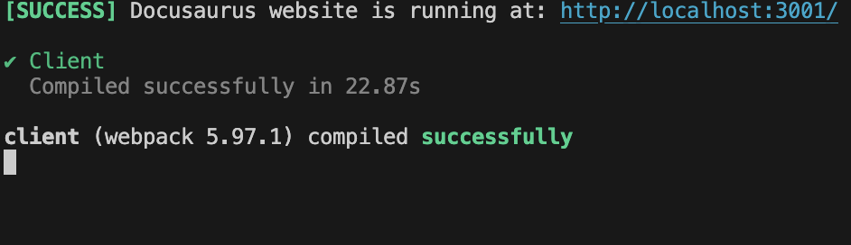
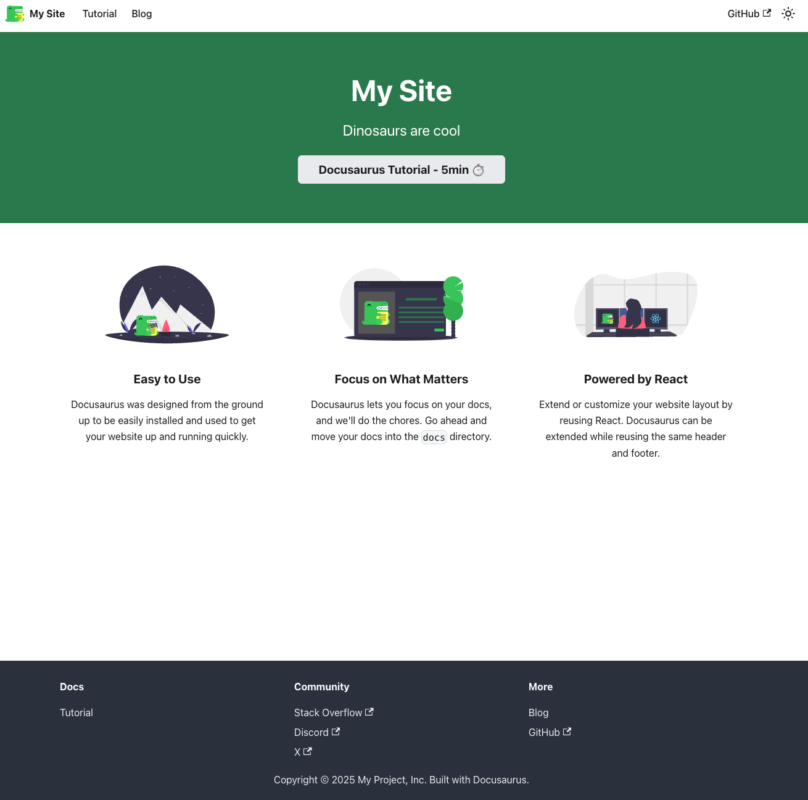

`docusaurus`를 이용해서 github 블로그 만들기(1) - 일단 프로젝트 만들어서 github.io로 배포해보기

<!-- truncate -->

## 👩‍💻docusaurus 프로젝트 생성

다음 명령어로 만들고자 하는 프로젝트를 생성해줍니다.

```bash
npx create-docusaurus@latest ${test-site} classic
```

test-site 자리에 자신의 프로젝트 이름을 지정합니다.  
위 명령어를 적용하면 현재 폴더 하위에 프로젝트 폴더가 생성됩니다.

‼️주의 : 폴더명을 blog나 docs로는 생성하지 마세요. `docusaurus`자체에서 `router`로 사용되고 있으며, 해결법이 있을진 모르지만 저는 해결하지 못해 다시 갈아엎고 프로젝트를 만들었습니다. 😭

### 언어 선택

```bash
> JavaScript
> TypeScript
```

엔터를 치면 다음과 같이 `JavaScript`로 할 건지, `TypeScript`로 할 건지 선택해야합니다.  
`JavaScript`로 선택했더니 `jsx`가 아닌 `js`확장자여서 저는 `TypeScript`로 지정해주었습니다

### 프로젝트 파일로 이동

```bash
cd test-site
```

프로젝트가 생성되었습니다. 만들어진 프로젝트 폴더로 가서 로컬로 실행해봅니다.

### 로컬로 실행해보기

```bash
npm start
```


http://localhost:3000 으로 접근할 수 있습니다.(화면에서는 기존에 띄워두던 로컬이 있어서 다른 포트입니다.)


아무 설정도 하지 않은 채 로컬로 실행하면 다음과 같은 화면이 뜹니다.
화면 설정하는 것은 다음 블로그 글에서 해보고, 우선 저장소 연결과 배포 설정부터 해보겠습니다.

## 👩‍💻원격 저장소 연결

```bash
git init
git remote add origin https://github.com/사용자이름/저장소폴더이름.git
git add .
git commit -m "커밋메세지 작성"
git push -u origin main
```

이때 원격저장소의 상태는 아무 파일도 없는 상태여야 합니다.

## 👩‍💻github action으로 github.io, github.io/폴더명 배포하기

깃헙 블로그로 만들고 싶은데 기존에 사용하던 xxx.github.io URL이 있어 저장소 이름으로 URL을 설정해야하는 경우, 폴더명으로 배포해야하는 경우도 명시해놓았습니다.

- xx.github.io
- xx.github.io/xxxx

### Github actions 배포 세팅 설정

#### github 저장소의 settings > Pages로 들어가기

- source 탭에서 Deploy from a branch > Github Actions로 변경

#### 저장소 root에 .github/workflows/deploy.yml 파일 추가

```yml
name: Deploy to GitHub Pages

on:
  push:
    branches:
      - main
jobs:
  build:
    name: Build Docusaurus
    runs-on: ubuntu-22.04
    steps:
      - uses: actions/checkout@v4
        with:
          fetch-depth: 0
      - uses: actions/setup-node@v4
        with:
          node-version: 18
          cache: npm

      - name: Install dependencies
        run: npm install
      - name: Build website
        run: npm run build

      - name: Upload Build Artifact
        uses: actions/upload-pages-artifact@v3
        with:
          path: build

  deploy:
    name: Deploy to GitHub Pages
    needs: build

    permissions:
      pages: write # to deploy to Pages
      id-token: write # to verify the deployment originates from an appropriate source

    environment:
      name: github-pages
      url: ${{ steps.deployment.outputs.page_url }}

    runs-on: ubuntu-22.04
    steps:
      - name: Deploy to GitHub Pages
        id: deployment
        uses: actions/deploy-pages@v4
```

이렇게 설정해두면 main 브랜치에 푸시할 때마다 배포가 진행됩니다.

### xxx.github.io/로 배포할 때

#### docusaurus.config.ts

```typescript
url: "https://${GITHUB_USERNAME}.github.io",
baseUrl: "/",
organizationName: "${GITHUB_USERNAME}",
projectName: "${GITHUB_USERNAME}.github.io",
presets: [
    [
      {
        docs: {
          editUrl: "https://github.com/${GITHUB_USERNAME}/${GITHUB_USERNAME}.github.io/tree/main",
        },
        blog: {
          editUrl: "https://github.com/${GITHUB_USERNAME}/${GITHUB_USERNAME}.github.io/tree/main",
        },
      } satisfies Preset.Options,
    ],
  ],
```

### xxx.github.io/xxxx로 배포할 때

```typescript
url: "https://${GITHUB_USERNAME}.github.io",
baseUrl: "/${GITHUb_REPO_PATH_NAME}/",
// baseUrl: 예를들어 https://github.com/rowanna/test이면 "/test/"
organizationName: "${GITHUB_USERNAME}",
projectName: "${GITHUb_REPO_PATH_NAME}",
// projectName: 예를들어 https://github.com/rowanna/test이면 "test"
presets: [
    [
      {
        docs: {
          editUrl: "https://github.com/${GITHUB_USERNAME}/${GITHUb_REPO_PATH_NAME}/tree/main",
        },
        blog: {
          editUrl: "https://github.com/${GITHUB_USERNAME}/${GITHUb_REPO_PATH_NAME}/tree/main",
        },
      } satisfies Preset.Options,
    ],
  ],
```

## 👩‍💻배포완료


## 출처

[도큐사우르스 docs](https://docusaurus.io/docs)
[도큐사우르스 deployment](https://docusaurus.io/docs/deployment)
