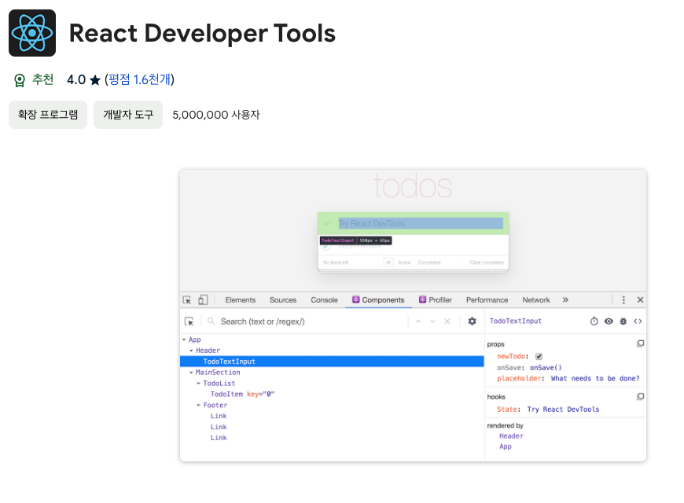
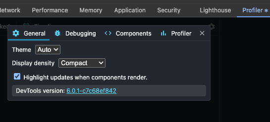
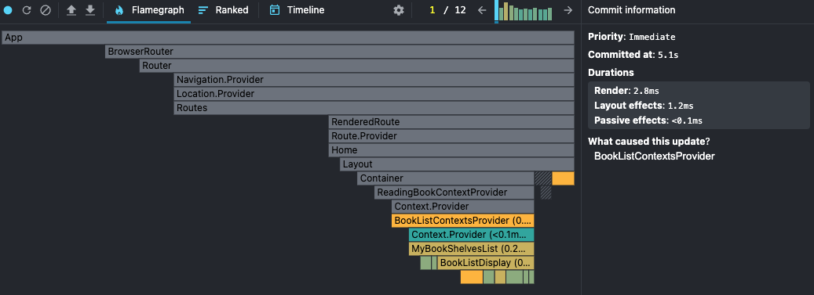
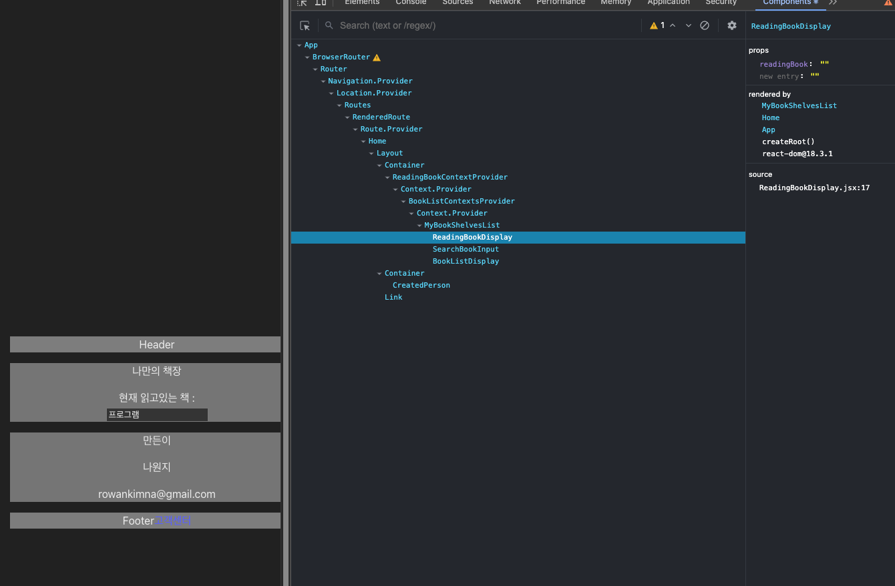

react profiler로 컴포넌트 렌더를 측정해보는 방법들

<!-- truncate -->

## ✨React Dev Tools 설치 및 세팅

### 설치하기

‼️ 크롬 기준입니다.

[React Dev Tools](https://chromewebstore.google.com/detail/react-developer-tools/fmkadmapgofadopljbjfkapdkoienihi?hl=ko)에 들어가서 확장 프로그램을 설치합니다.


### 세팅하기



개발자도구 -> Profiler -> 톱니바퀴 아이콘 클릭 -> General -> Highlight updates when components render. 체크하시면 됩니다.

## ✨성능 프로파일을 통해서 렌더링이 얼마나 되는지 확인해보자

### 렌더링 과정 레코딩하기

- 개발자 도구 -> profiler -> 상단 왼쪽의 파란색 동그라미 클릭 -> 서비스 동작 후 -> 상단 왼쪽의 붉은색 동그라미 클릭하면 측정이 끝납니다.

  
  

총 2.8ms 비용이 발생한 것으로 보이네요.

### 컴포넌트 정보 확인하기

- 개발자 도구 -> component
  component 탭에 가면 컴포넌트의 계층 정보와 props 정보 등을 알 수 있고 수정도 가능합니다.
  

## ✨React 성능 프로파일링 이용해서 컴포넌트 렌더링 시간 알아보기

```jsx
import React, { Profiler } from "react";

function onRenderCallback(
  id,
  phase,
  actualDuration,
  baseDuration,
  startTime,
  commitTime,
  interactions
) {
  console.log(`컴포넌트 ${id}의 렌더링 시간: ${actualDuration}`);
}

function MyComponent() {
  return (
    <Profiler id="MyComponent" onRender={onRenderCallback}>
      {/* 컴포넌트 내용 */}
    </Profiler>
  );
}
```

```text
# 결과물 예시
컴포넌트 MyComponent의 렌더링 시간: 78.5
```

### 출처

항해플러스 3기 Frontend Docs
