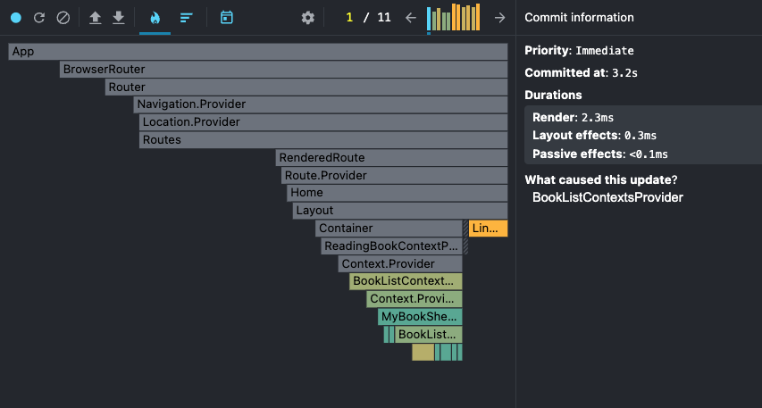
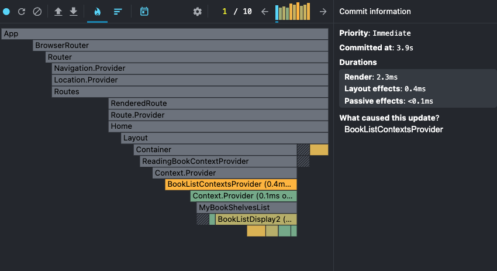

구현된 작은 react예제 성능 최적화해보기 - 리액트 프로파일러 활용

{/* truncate */}

## 🤾 요구사항

- **나만의 책장** : 3개의 컴포넌트
  - **현재 읽고있는 책** : 아래 책 리스트 중 읽고싶은 책에 읽기 버튼 클릭 시, 해당 책을 검색창 위에 노출
    - 읽고있는 책을 localStorage 에 저장하여 페이지 새로고침해도 책 검색창 위에 노출되도록
  - **책 검색창** : 아래 책 리스트 중 검색하고 싶은 책이 있을 경우 텍스트 입력하고 엔터 누르면 검색
  - **책 리스트** : 내가 가진 모든 책들을 나열하여 표기한다
  - **책 상세페이지** : 책 리스트에서 책을 클릭하면 해당 책의 상세 페이지로 이동
- **만든이** : 1개의 컴포넌트 = 이름과 이메일 표기
- **레이아웃** (헤더 + 푸터) : 모든 페이지의 상단과 하단에는 공통된 헤더 + 푸터가 표기되어야 한다.
  - **고객센터 페이지** : 레이아웃 푸터 내 고객센터 페이지로 이동하는 링크 추가

## 🤾 폴더 구조

```markdown
src
├── assets
│ ├── components
│ │ ├── Layout
│ │ │ ├── Container.jsx
│ │ │ ├── Layout.jsx # header, footer 포함된 레이아웃
│ │ ├── BookListDisplay.jsx # 책 리스트 컴포넌트
│ │ ├── CreatedPerson.jsx # 만든이 컴포넌트
│ │ ├── MyBookShelvesList.jsx # 나만의 책장 컴포넌트(input, 현재읽고 있는 책, 책 리스트 컴포넌트 포함)
│ │ ├── ReadingBookDisplay.jsx # 현재 읽고있는 책 컴포넌트
│ │ └── SearchBookInput.jsx # 검색 인풋 컴포넌트
│ ├── pages
│ │ ├── CustomerPage.jsx # 고객센터 페이지
│ │ ├── DetailPage.jsx # 클릭한 책 상세 페이지
│ │ └── Home.jsx # main 페이지
├── contexts # contextx 관리 폴더
│ ├── bookListContexts.jsx
│ └── readingBookContexts.jsx
├── mock
│ └── book.js # mock data
├── App.css
├── App.jsx # router 설정 파일
├── index.css
└── main.jsx
```

## 🤾 성능최적화를 해보자

### 부모 컴포넌트와 자식 컴포넌트의 props 결합도를 낮추자.

- 어차피 useContext()를 통해 전역으로 데이터를 관리할건데, 복잡하게 부모요소에서 props로 내려주지 않아도 된다. 오히려 쓸데없이 부모요소만 추가적으로 렌더링 될 뿐이다.

#### 부모컴포넌트 변경 전

```jsx
// MyBookShelvesList.jsx
import { useContext, useEffect } from "react";
import books from "../../mock/book";
import { readingBookContext } from "../../contexts/readingBookContexts";
import { bookListContexts } from "../../contexts/bookListContexts";
import ReadingBookDisplay from "../components/ReadingBookDisplay";
import SearchBookInput from "../components/SearchBookInput";
import BookListDisplay from "../components/BookListDisplay";

function MyBookShelvesList() {
  const { readingBook, setReadingBook } = useContext(readingBookContext);
  const { setBookList } = useContext(bookListContexts);
  const handleClick = (e) => {
    e.preventDefault();
    const parentElText = e.target.parentElement.innerText;
    const selectedBookTitle = parentElText.split("-")[0];

    setReadingBook(selectedBookTitle);
    localStorage.setItem("readingBook", selectedBookTitle);
  };

  useEffect(() => {
    localStorage.getItem("readingBook") &&
      setReadingBook(localStorage.getItem("readingBook"));

    setBookList(books);
  }, []);

  return (
    <>
      <ReadingBookDisplay readingBook={readingBook} />
      <SearchBookInput />
      <BookListDisplay onClick={handleClick} />
    </>
  );
}

export default MyBookShelvesList;
```

부모컴포넌트가 지나치게 로직을 많이 가지고 있는 걸 확인 할 수 있다.

#### 부모컴포넌트 변경 후

```jsx
import ReadingBookDisplay from "../components/ReadingBookDisplay";
import SearchBookInput from "../components/SearchBookInput";
import BookListDisplay from "../components/BookListDisplay";

function MyBookShelvesList() {
  return (
    <>
      <ReadingBookDisplay />
      <SearchBookInput />
      <BookListDisplay />
    </>
  );
}

export default MyBookShelvesList;
```

### React.memo, useMemo, useCallback을 성능 최적화 해보기

- `React.memo` : 리액트 컴포넌트 자체를 저장
- `useMemo` : 함수의 결과값 저장
- `useCallback` : 함수 구현체 자체를 저장

#### BookListDisplay.jsx

```jsx
import { bookListContexts } from "../../contexts/bookListContexts";
import { readingBookContext } from "../../contexts/readingBookContexts";
import { useContext, memo, useEffect, useCallback } from "react";
import { Link } from "react-router-dom";
import books from "../../mock/book";

const BookListDisplay = memo(function BookListDisplay() {
  const { setReadingBook } = useContext(readingBookContext);
  const { bookList } = useContext(bookListContexts);
  const { setBookList } = useContext(bookListContexts);

  useEffect(() => {
    setBookList(books);
  }, []);
  // ✨ 여기!!
  const handleClick = useCallback((e) => {
    e.preventDefault();
    const parentElText = e.target.parentElement.innerText;
    const selectedBookTitle = parentElText.split("-")[0];

    setReadingBook(selectedBookTitle);
    localStorage.setItem("readingBook", selectedBookTitle);
  });
  return (
    <>
      <ul>
        {bookList.map(({ title, author, id }) => (
          <li key={id}>
            <Link to={`/detail/${id}`}>
              {title}-{author}
              <button
                onClick={handleClick}
                style={{ padding: "0.2rem 0.4rem", marginLeft: 4 }}
              >
                읽기
              </button>
            </Link>
          </li>
        ))}
      </ul>
    </>
  );
});

export default BookListDisplay;
```

`handleClick` 함수는 onClick 이벤트가 실행될 때마다 생성되기 때문에 생성되지 않도록 useEffect를 적용해주었다.

#### SearchBookInput.jsx

```jsx
import { useCallback, useContext, useRef } from "react";
import { bookListContexts } from "../../contexts/bookListContexts";
import books from "../../mock/book";
function SearchBookInput() {
  const inputRef = useRef("");
  const { setBookList } = useContext(bookListContexts);

  // ✨ 여기!!
  const handleKeyupEvent = useCallback((e) => {
    const searchWord = inputRef.current.value;

    if (e.key !== "Enter" || !searchWord.trim()) return;

    const searchedBookList = books.filter(({ title }) =>
      title.includes(searchWord)
    );
    setBookList(searchedBookList);
  });
  return <input onKeyUp={handleKeyupEvent} ref={inputRef} />;
}

export default SearchBookInput;
```

`handleKeyupEvent` 이벤트도 위와 동일해서 `useCallback`을 적용했다.

#### 전



#### 후



큰 서비스가 아니라서 Render duration은 크게 차이나지 않지만 굳이 렌더 되지않아도 될 부모컴포넌트가 렌더 되지않음을 확인했다. 그리고 전에서는 3개의 모든 자식컴포넌트가 렌더링되었는데, useContext로 데이터가 바뀌는 2개의 컴포넌트만 렌더링 되는 것을 확인할 수 있었다.

## 🤾 성능최적화 완료

<video width="100%" controls>
  <source src="/before.mov" />
</video>

## 🤾 성능최적화 완료

[사이트 보러가기](https://rowanna.github.io/my-react-bookshelves/)
