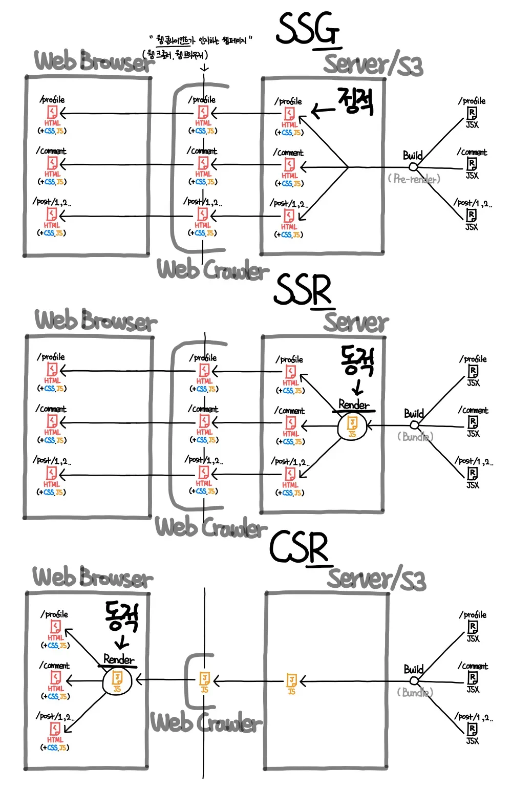

Next.js를 왜 써야할까?🤔

웹 페이지 렌더 방식인 SSG, CSR, SSR, ISR에 대해 알아보고, SPA, MPA가 뭔지도 알아봅시다

<!-- truncate -->

## ✨Next.js란?

Next.js는 **풀스택 웹 애플리케이션을 만들기 위한 리액트 프레임워크**입니다.

React에 필요한 번들링, 컴파일 등의 필요한 도구들을 추상화하고 자동으로 구성화하여 이를 통해 구성 설정에 시간을 할애하지 않고 애플리케이션 구축에 효율적으로 집중할 수 있게 합니다.

## ✨Next.js의 주요 특징은 무엇일까?

- **파일 시스템 기반**으로 라우터 설정이 가능합니다.
- 클라이언트 컴포넌트, 서버 컴포넌트로 **CSR, SSR**이 가능해집니다.
- 서버 컴포넌트에서 async, await으로 **데이터 fetching이 간소화되며, 요청 메모이제이션, 데이터 캐싱 및 재검증**을 위한 확장된 fetch API가 제공됩니다.
- **CSS Modules, Tailwind CSS, CSS-in-JS**를 지원합니다.
- **이미지, 폰트, 스크립트 최적화**를 제공합니다.
- **타입스크립트**를 지원합니다.

## ✨ 웹 페이지 렌더링 방식에서 바라본 Next.js

우리는 여기에서 **SSG, CSR, SSR, ISR** 관점에서 집중하여 next.js의 주요 장점을 알아보려고 합니다.

우선 SSG, CSR, SSR, ISR가 뭔지 개념부터 간단하게 짚고 넘어가봅시다.
| 렌더링 방식 | 특징 | 렌더링 주체 | 실시간성 | SEO 가능 여부 | 초기 로딩 속도 | 이후 로딩 속도 |
|-------|------|------------|----------|---------------|---------------|--------------|
| **SSG (Static Site Generation)** | 미리 생성된 HTML 제공 | 서버가 빌드 (렌더가 아님 생성임.) | ❌ | ✅ | 🚀 빠름 | 🚀 빠름 |
| **CSR (Client Side Rendering)** | 클라이언트에서 JS로 렌더링 | 클라이언트 | ✅ | ❌ | 🐢 느림 | 🚀 빠름 |
| **SSR (Server Side Rendering)** | 요청 시 서버에서 HTML 생성 | 서버 (요청 시) | ✅ | ✅ | ⚡ 적당히 빠름 | ⚡ 적당히 빠름 |


웹 크롤러를 기준으로 그림을 이해하면 각 방식이 SEO가 어떻게 이루어지는지 이해하기 쉬울 것입니다.(애런쌤 좋은 설명 감사해요...!!)

### SSG(Static Site Generation)

- S3같은 별개 저장소 사용 시 서버가 불필요 합니다.( 셀프 호스팅이 유용합니다.)
- 서버가 가지고 있는 정적 웹페이지를 반환만 하면 되기 때문에 매우 빠른 웹 페이지 반환속도를 경험할 수 있습니다.

### CSR(Client Side Rendering)

- **CSR(Client Side Rendering) = SPA(Single Page App)**
- **웹 브라우저 내 html과 무거운 js + js반환을 위한 웹서버 or 저장소(S3)**
- 모든 화면 전환이 서버를 거쳐오지 않고 웹 브라우저에서 일어납니다.

### SSR(Server Side Rendering)

- **SSR(Server Side Rendering) = MPA(Multi Page App)**
- **1000명의 유저 정보 페이지 = 1개의 유저 정보 페이지 템플릿(HTML) + 1000명 유저 정보 데이터베이스**
- 서버가 동적 웹 페이지를 생성하여 반환하기 때문에 반복되는 템플릿과 실시간 정보를 분리했다고 볼 수 있습니다.
- DB 조회속도와 웹 페이지 생성 속도에 의존하게 됩니다.
  - 웹 서버의 CPU, 메모리 자원이 사용된기 때문에 AWS같은 클라우드 사용 시 비용이 부담됩니다.

### ISR(Incremental Static Regeneration)

- SSG(Static Site Generation)의 장점(빠른 로딩속도, SEO최적화)를 유지하면서도 정적 페이지를 주기적으로 갱신할 수 있도록 만든 기술입니다.
- **간단하게 얘기해서, 빌드 시 생성된 정적 페이지를 일정 주기로 다시 생성하는 기술**
- 이렇게만 얘기하면 SSR이랑 다른점이 뭐냐고 생각할 수 있습니다.
  ISR은 **정적 페이지처럼 빠르지만, 일정 주기로 최신 데이터가 반영되는 방식**이며 SSR은 **매 요청마다 새로운 데이터를 반영하는 방식**이라고 생각하면 됩니다.

#### ISR과 SSR의 차이점

| 렌더링 방식 | HTML 생성 시점                                                                     | 캐싱                           | 페이지 로딩 속도                                | 서버 부담                         | 실시간성                                |
| ----------- | ---------------------------------------------------------------------------------- | ------------------------------ | ----------------------------------------------- | --------------------------------- | --------------------------------------- |
| **ISR**     | **첫 요청 시 기존 HTML 제공, 이후 `revalidate` 시간이 지나면 백그라운드에서 갱신** | ✅ 캐싱 O (이전 HTML 유지)     | 🚀 첫 요청 빠름 (정적 HTML 반환)                | 🔸 낮음 (재생성 시에만 서버 사용) | ⚡ 준실시간 (최신 데이터 반영까지 지연) |
| **SSR**     | **매 요청마다 HTML 새로 생성**                                                     | ❌ 캐싱 X (항상 서버에서 생성) | 🐢 상대적으로 느림 (서버에서 HTML 생성 후 응답) | 🔥 높음 (모든 요청에서 서버 사용) | ✅ 실시간 (최신 데이터 즉시 반영)       |

#### 코드 예제

📌 getStaticProps에서 revalidate 옵션을 추가하면 ISR이 적용됩니다.

```tsx
export async function getStaticProps() {
  const res = await fetch("https://api.example.com/posts/1");
  const post = await res.json();

  return {
    props: { post },
    revalidate: 10, // 10초마다 정적 페이지를 갱신
  };
}

export default function BlogPost({ post }) {
  return (
    <div>
      <h1>{post.title}</h1>
      <p>{post.content}</p>
    </div>
  );
}
```

### Next.js는 이 모든 걸 지원한다.

Next.js는 CSR + SSR + SSG + ISR 모두 지원합니다.

- CSR : 클라이언트에게 웹 페이지 요청 시 바로 만들어 반환해도 될 컴포넌트(데이터 필요없는 UI성 컴포넌트)
- SSR : API, DB가 필요해서 서버에게 웹 페이지 요청 시 바로 만들어 반환해도 될 컴포넌트
- SSG : API, DB가 필요하고 빌드타임에 미리 생성해놓아도 될 컴포넌트

**물론 이것들은 개발자들이 컴포넌트 개발 시 파일에 명시하는 식으로 이루어져 있습니다.**  
그렇기에 **이 렌더링에 대해 명확히 이해해야 Next.js에서 최적의 성능**을 끌어낼 수 있습니다.

## ✨Next.js가 그렇게 좋다는데... 또 어떤 점이 좋을까?

### SEO 최적화

기본적으로 React 애플리케이션은 SPA(Single Page Application)이라서. SEO에 취약합니다.  
하지만 Next.js는 SSR이나 SSG로 HTML을 미리 생성해 검색 엔진이 쉽게 크롤링 할 수 있도록 도와줍니다.

```tsx title="pages/index.tsx(next.js12이하 버전)"
import Head from "next/head";

export default function Page() {
  return (
    <>
      <Head>
        <title>My page title</title>
      </Head>
    </>
  );
}
```

12버전에서는 메타태그도 useEffect을 통해 동적으로 관리 가능합니다.

```tsx title="app/page.tsx(next.js13+버전)"
import type { Metadata } from "next";

export const metadata: Metadata = {
  title: "My Page Title",
};

export default function Page() {
  return "...";
}
```

### 국제화(i18n) 지원

다국어 지원 기능이 내장되어 있어 별도의 라이브러리 없이 쉽게 다국어 처리를 할 수 있습니다.
`next.config.ts` 에서 설정만 하면 간단하게 다국어 페이지 를 만들 수 있습니다.

```ts title="next.config.ts"
module.exports = {
  i18n: {
    locales: ["en", "ko"], // 지원할 언어 목록
    defaultLocale: "en", // 기본 언어 (사용자가 언어 선택 안 했을 때)
  },
};
```

<!-- ### 아키텍처 상 Next.js 서버의 역할

Next.js는 데이터베이스에 직접 접속하여 백엔드역할과 데이터를 변환해주는 BFF역할도 가능합니다.

#### 백엔드로서의 Next.js

#### BFF로서의 Next.js -->

## ✨출처

- ASAC 07기 노션
- [Next.js docs](https://nextjs.org/docs)
