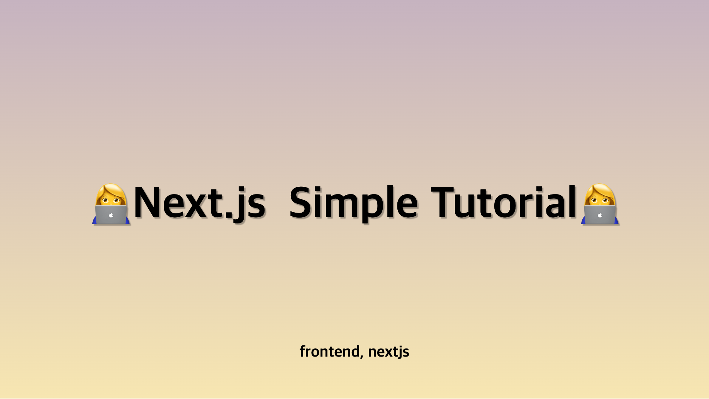
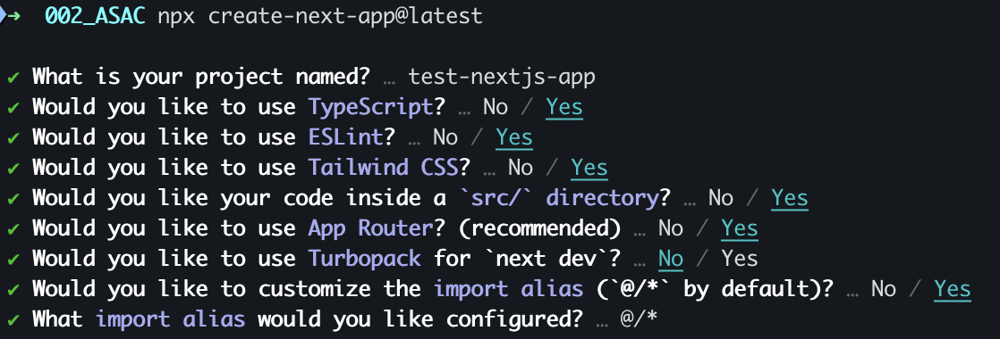
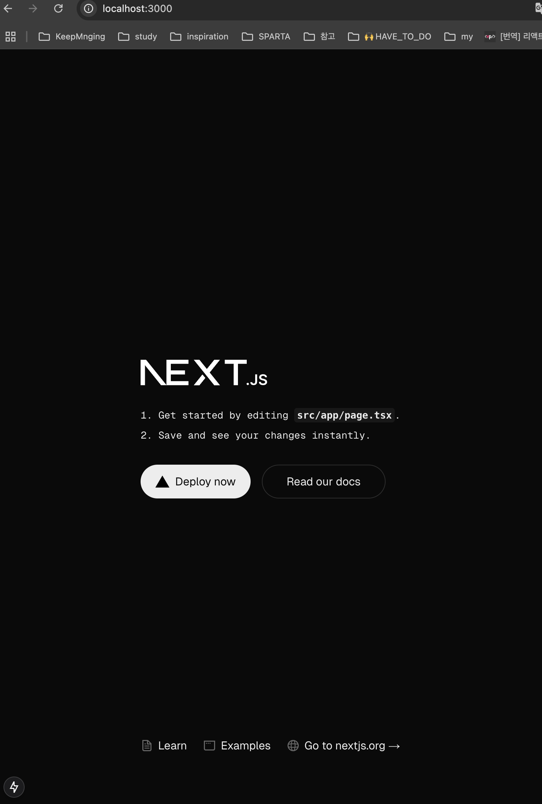
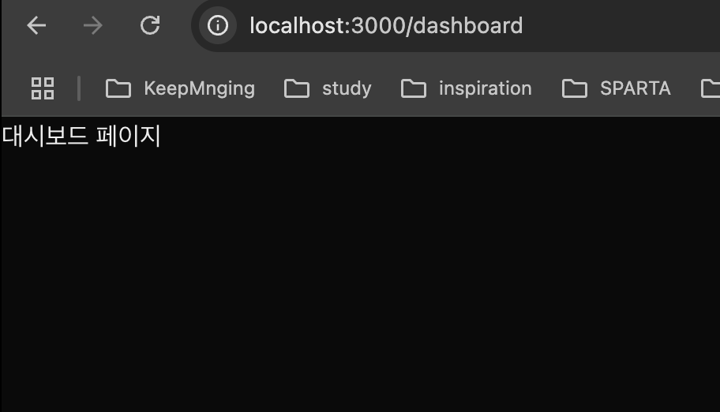
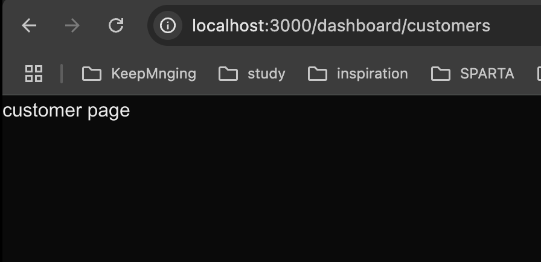
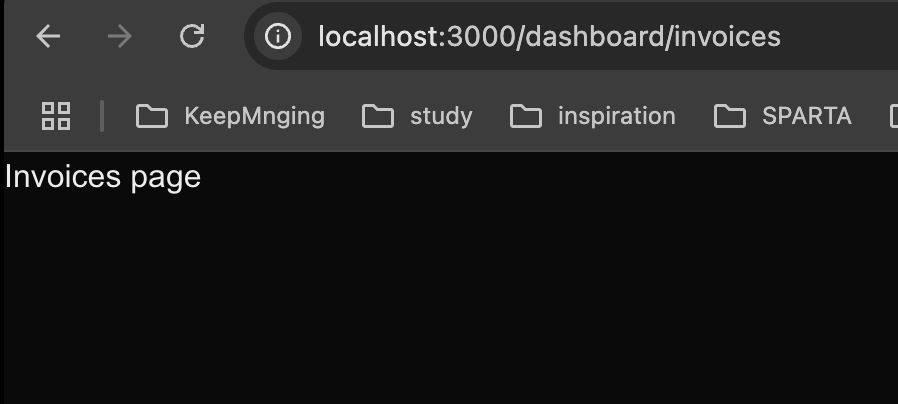

<head>
  <meta property="og:image" content="/blog/2025-01-28-nextjs-simple-tutorial-first/image-6.png" />
</head>


Next.js와 친해지기 위한 간단한 튜토리얼(Route - 페이지 설정)

<!-- truncate -->

## 👩‍💻 Next.js 프로젝트 생성

다음 명령어로 next.js 프로젝트를 생성해줍니다.

```bash
npx create-next-app@latest
```


생성하게 되면 위와 같이 선택할 수 있습니다.

### TypeScript

- TypeScript는 정적 타입을 검사하며 컴파일 타임에 오류를 발견하여 런타임 오류를 줄입니다.
- 이는 타입 정의로 코드의 안정성을 확보하고, 문서화가 대체 가능합니다.
- 이 옵션은 매우 추천되며, 특히 대규모 팀 프로젝트나 복잡한 애플리케이션 개발에 필수적입니다.

### ESLint

- ESLint는 전반적으로 코드 스타일을 강제하고 버그를 예방합니다.
- Prettier와 함께 사용하면 코드 정리가 자동화되며
- 특히 협업시에 필수적인 툴입니다.

### Tailwind CSS

- Tailwind CSS는 클래스의 조합으로 빠르게 UI개발이 가능합니다.
- 뿐만아니라 Tailwind CSS는 사용하지 않는 CSS를 퍼징하여 자동으로 제거합니다.
- 반응형 설정도 sm, md, lg와 같은 클래스 이름으로 간단히 설정 가능합니다.
- `tailwind.config.js`를 사용해 디자인 시스템 구축도 가능합니다.
- 빠른 디자인 시스템 구축이 필요하다면 추천하는 옵션입니다.

### `src/`directory

- `src/`directory를 사용하지 않고 root에 한꺼번에 업로드 하게 되면 설정파일과 소스코드가 섞이게 되어 혼란을 일으킬 수 있습니다.
- 웬만하면 사용하는 걸로...

### App Router

- App Router는 app 디렉토리 하위에 디렉토리를 생성하는 것만으로 router를 생성할 수 있습니다.
- Next.js 13+ 에서의 큰 특징인 React Server Components 지원이 가능합니다.
- 동적라우팅, SEO 최적화, 스트리밍 지원이 가능합니다.
- Next.js 13 이상에서는 App Router 사용을 권장하고 있습니다.

### Turbopack

- Turbopack은 Webpack 대비 10배 이상 빠른 초고속 번들러입니다.
- HMR(hot module reloading)을 지원하여 변경사항을 실시간으로 반영합니다.
- Vercel이 적극적으로 개발 중이므로 업데이트가 빠릅니다.

### import alias

- 상대 경로(`../../components`) 대신 절대 경로 사용 가능합니다.(예: `@/components/Button
`)
- 가독성이 향상되고 유지보수가 용이해집니다.
- 프로젝트의 모듈 구조가 깊어질수록 이점이 되는 옵션입니다.

이제 프로젝트 생성이 완료되었습니다.🤗  
로컬로 실행해볼까요?

## 👩‍💻 로컬로 실행해보기

```bash
npm run dev
```



다음과 같은 화면이 뜹니다.

## 👩‍💻 컴포넌트를 통해 새 페이지 만들어보기

### `page.tsx`는 뭘까...✨

페이지를 만들기 위해서는, react-router-dom과 다르게 폴더 생성만으로 라우트 설정이 가능합니다.  
page파일을 app 디렉토리 안에 `export default` React Component로 만들면 url이 생성됩니다.

```tsx title="app/page.tsx"
export default function Page() {
  return <h1>Hello Next.js!</h1>;
}
```

위의 경로대로 파일을 생성하면 `localhost:3000/`로 접근이 가능합니다.

### `layout.tsx`는 뭘까..✨

다수의 페이지에서 공유하는 UI라고 볼 수 있습니다.  
layout은 상태를 유지하고, 리렌더링 되지 않습니다.

```tsx title="app/layout.tsx"
export default function DashboardLayout({
  children,
}: {
  children: React.ReactNode;
}) {
  return (
    <html lang="en">
      <body>
        {/* Layout UI */}
        {/* Place children where you want to render a page or nested layout */}
        <main>{children}</main>
      </body>
    </html>
  );
}
```

주의할 점은, 프로젝트의 루트인 app 디렉토리에 있는 layout은 꼭 `html` , `body` 태그를 포함해야한다는 것입니다.

### dashboard 디렉토리 및 파일 생성

이제 라우터를 만들어 봅시다.  
react에서는 react-router-dom을 활용하여 각 페이지마다 jsx를 연결해주어야 했습니다.  
하지만 next.js에서는 App router가 도입되면서 app 하위에 디렉토리를 구성하는 것만으로도 페이지 생성이 가능하게 되었습니다.

`/dashboard` 패스로 접근 할 수 있는 페이지를 만들어봅시다.

```tsx title="src/app/dashboard/page.tsx"
import Link from "next/link";

export default function Dashboard() {
  return <>대시보드 페이지</>;
}
```

### dashboard url에 접근하기 위한 버튼 생성

dashboard url에 접근하기 위해 Home의 `page.tsx`에 버튼을 추가해줍시다.

```tsx title="src/app/page.tsx"
import Link from "next/link";

export default function Home() {
  return (
    <div className="grid grid-rows-[20px_1fr_20px] items-center justify-items-center min-h-screen p-8 pb-20 gap-16 sm:p-20 font-[family-name:var(--font-geist-sans)]">
      <main className="flex flex-col gap-8 row-start-2 items-center sm:items-start">
        <div className="flex gap-4 items-center flex-col sm:flex-row">
          // a링크로도 가능하지만 SPA처럼 동작하기 위해선 Link태그를 써야합니다.
          <Link href={"/dashboard"}>대시보드로 바로가기</Link>
          // <a href={"/dashboard"}>대시보드로 바로가기</a>
        </div>
      </main>
    </div>
  );
}
```

버튼을 클릭하면 아래 사진과 같이 대시보드 페이지로 이동하게 됩니다.
이렇게 대시보드 페이지를 만들었습니다.


그런데, 만약 path 뎁스를 깊어지게 하려면 어떻게 해야할까요?

### `/dashboard/customers` 페이지와 `/dashboard/invoices` 페이지 만들기

dashboard 폴더 안에 customers폴더와 invoices를 만들고, 각각 `page.tsx`를 생성하면 됩니다.

```tsx title="src/app/dashboard/customers/page.tsx"
export default function Customers() {
  return <div>customers page</div>;
}
```



```tsx title="src/app/dashboard/invoices/page.tsx"
export default function Invoices() {
  return <div>Invoices page</div>;
}
```



다음 포스트에선 Route를 이용하여 백엔드 API를 만들어봅시다.

## 👩‍💻 출처

ASAC 7기 노션
