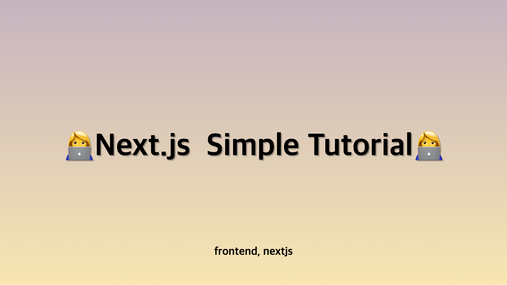

**`Next.js`와 친해지기 위한 간단한 튜토리얼(Route - 백엔드 API 설정)**

<!-- truncate -->

## API Route

`Next.js`의 Route Handlers는 기본적으로 백엔드 API를 제공하는 엔드포인트 역할을 합니다.
요청이 올 때만 실행되는 서버리스(Serverless)방식으로 동작하는데요,
데이터베이스 연동, API 프록시, 인증 등의 간단한 백엔드 기능을 수행할 수 있습니다.
하지만 websocket같은 장기 실행 프로세스에는 적합하지 않습니다.

## API 엔드포인트 구축하기

Next.js에서는 pages/api 폴더 내의 모든 파일이 /api/\*에 매핑되며 페이지가 아닌 API 엔드포인트로 처리됩니다. 자, 이제 첫 번째 API 엔드포인트를 만들어봅시다.

```bash
mkdir pages/api
touch pages/api/hello.js
```

hello.js에서 간단한 함수를 작성하여 인사 메시지와 함께 JSON 응답을 반환해 보겠습니다.

```tsx
export default function handler(req, res) {
  res.status(200).json({ message: "안녕하세요, Next.js!" });
}
```

그리고 완성입니다! 이제 Next.js를 사용하여 첫 번째 API 엔드포인트를 만들었습니다. 이 엔드포인트는 http://localhost:3000/api/hello에서 접근할 수 있습니다.

## 참고

- [Next js로 API 만들어 사용하기(API routes)](https://surviveasdev.tistory.com/entry/Next-js%EB%A1%9C-API-%EB%A7%8C%EB%93%A4%EC%96%B4-%EC%82%AC%EC%9A%A9%ED%95%98%EA%B8%B0API-routes)
- [API Routes를 활용하여 API만들기](https://kyuntechblog.tistory.com/31)
- [Next.js로 REST API 만들기: 종합 가이드](https://apidog.com/kr/blog/next-js-build-rest-api-2/)
