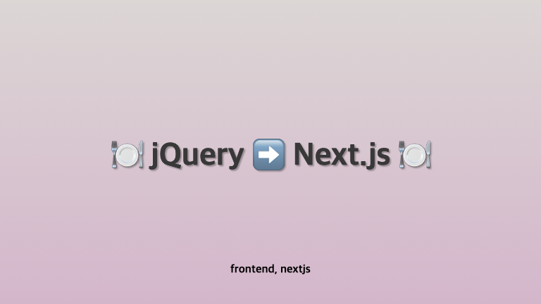

**2020년 취업 초반에 만들었던 jQuery 포트폴리오를 Next.js로 업그레이드하면서 적는 Next.js 고군분투기**

<!-- truncate -->

처음 취업 준비 때 막무가내로 만들었던 [포트폴리오](https://rowanna.github.io/portfolio-v1/html/port/main/index4.html).  
[어떤 한 사이트](https://aainterior.com.ua/)를 참고해가며 클론코딩을 만든 포트폴리오였습니다.  
나름 php도 붙여가며 회원가입, 로그인기능도 붙여놨지만 유지보수를 안하기도 했고 어찌저찌하여 내 손을 떠나게 되었는데, 그 때 막 퍼블리싱을 배우던 때라 jQuery로 성능도 생각하지 않고 냅다 코딩했던 기억만 있어요.  
다시 코드를 까보니 넘나 더러워서.... 언젠가 업그레이드 해야겠다고 생각한 거 지금 react, next.js 배우고 있는 김에 업그레이드해봐야겠다고 결심했습니다.

- **[https://aainterior.com.ua/](https://aainterior.com.ua/)를 클론코딩한 사이트 입니다.**

## 🍽️ next.js로 선택한 이유

### 구글 폰트 내장 지원

해당 파일을 보면, css를 파악하는데 좀 시간이 오래 걸렸습니다.  
나름 `reset.css`도 적용하고 레이아웃은 레이아웃대로, 잘 분리했다고 생각했는데 **폰트 설정도 다 모여있고 해서 파일 관리하기가 복잡해보였어요.**  
실제로 퍼블리싱 할 때 직접 구글 폰트 찾거나 아니면 폰트 파일을 다운로드 받아서 임포트 해주고... 그걸 font-face로 지정해주고 하는 과정이 번거롭게 느껴졌습니다.  
구글 폰트가 내장으로 지원된다는 점은 이런 면에서 매력적이었어요!

### 빠른 로딩속도 개선

아무래도 인터랙티브한 UI들은 `jQuery`로 **DOM을 직접 지정**하여 인터랙션을 준 것들이라서 소스가 무겁다고 판단했습니다.  
`Next.js`는 자동 코드 분할과 최적화된 빌드 시스템을 제공하여 성능을 최적화하기 때문에 이는 사용자 경험을 크게 개선할 수 있을 거라고 생각했어요.

### `React` 생태계 활용

`React`를 실무에서 적용해본 적이 없고 경험을 많이 쌓고 싶다고 생각한 찰나에 마침 `Next.js`를 입문하고 있었습니다.  
원페이지의 동적 데이터 교환이 없는 페이지여서 `Next.js`의 특장점을 살리는 프로젝트는 아니겠지만 그래도 React 생태계를 활용한다는 점에서 매력을 느껴 결정하게 되었어요.

### SEO 최적화

굳이 React로 하지 왜 `Next.js`로? 라는 생각이 들 수 있다고 생각합니다.  
그럼에도 불구하고 `Next.js`를 선택한 그 이유는 다음과 같습니다.  
jQuery로 작성한 포트폴리오에서 meta태그로 검색엔진에 잘 걸릴 수 있게 설정을 해두었는데, 그런 면에서 `Next.js`가 SEO 측면에서 도움이 되지 않을까 생각했습니다.

### CSS module 사용가능

처음 next앱을 셋팅할 때 css module로 사용할 수 있도록 지정해주었는데요, tailwind같은 프레임워크를 사용하지 않았던 이유는 css 디자인 비중이 높아서 였습니다. 이미지요소도 많았지만, 커스텀해서 스타일을 지정해주어야하는 부분이 많았고, css 모듈에 대해 좀 더 알아보고 싶어서 선택했습니다.

## 🍽️ 프로젝트 세팅

자 그럼 프로젝트를 세팅해봅시다.
[Next.js simple tutorial 보러가기](https://rowanna.github.io/blog/nextjs-simple-tutorial-first)

```
npx create-next-app@latest
```

## 🍽️ meta tag 세팅

meta tag를 설정해 봅시다.

```tsx title="src/app/layout.tsx"
export const metadata: Metadata = {
  title: "rowanna porfolio 2020",
  description: "next.js로 업데이트 한 jQuery 포트폴리오 입니다.",
  keywords:
    "나원지, 포트폴리오, portfolio, rowanna, 웹퍼블리셔, 웹퍼블리셔 포트폴리오",
  icons: {
    icon: "/favicon-128.jpg",
  },
  openGraph: {
    title: "Wonji Na Portfolio",
    description: "웹 퍼블리셔 나원지의 포트폴리오 사이트입니다.",
    images: "/meta-img.jpg",
  },
};
```

여기서 이미지 경로는 src/public이 아니라 public에 파일을 넣어둡니다.
기존의 favicon.ico는 삭제해 주었습니다.

## 🍽️ 폴더 구조 세팅

다음 구조는 `src/app` 디렉토리의 구조입니다.

```md
/app
├── layout.tsx
├── page.tsx
├── components/ # ✅ 컴포넌트 모음 폴더
│ ├── ui/ # ✅ (1) UI 공통 컴포넌트
│ │ ├── Button/ # ✅ Button 컴포넌트 폴더
│ │ │ ├── Button.tsx
│ │ │ └── Button.module.css
│ │ └── index.ts # UI 컴포넌트들을 한 번에 export
│ │
│ ├── layout/ # ✅ (2) 레이아웃 관련 컴포넌트
│ │ ├── Header/ # ✅ Header 컴포넌트 폴더
│ │ │ ├── Header.tsx
│ │ │ └── Header.module.css
│ │ ├── Footer/ # ✅ Header 컴포넌트 폴더
│ │ │ ├── Footer.tsx
│ │ │ └── Footer.module.css
│ │ └── index.ts
│ │
│ ├── sections/ # ✅ (3) 특정 페이지에 포함되는 섹션 컴포넌트
│ │ ├── Main/ # ✅ Main 컴포넌트 폴더
│ │ │ ├── Main.tsx
│ │ │ └── Main.module.css
│ │ └── Info/ # ✅ Info 컴포넌트 폴더
│ │ ├── Info.tsx
│ │ └── Info.module.css
│ └── index.ts # 모든 컴포넌트들을 한 번에 export
│
├── styles/ # 전역 스타일
├── public/ # 정적 파일 (이미지, 폰트 등)
└── ...
```

```tsx title="src/app/components/index.tsx"
import Layout from "@/app/components/layout";
import Main from "@/app/components/sections/Main/Main";

export default function Container() {
  return (
    <>
      <Layout>
        <Main />
      </Layout>
    </>
  );
}
```

위처럼 모든 컴포넌트를 `component`폴더의 `Container`에 넣고 최종 `page.tsx`에서 아래와 같이 임포트 했습니다.

```tsx title="src/app/page.tsx"
import Container from "@/app/components";

export default function Home() {
  return <Container></Container>;
}
```

## 🍽️ reset.css 적용

크로스 브라우징, 일관된 css 스타일 제공을 위해 reset.css를 설정합니다.  
원래는 [meyerweb](https://meyerweb.com/eric/tools/css/reset/)을 적용했었는데, 요즘에는 브라우저 간 호환성이 좋아지면서 불필요한 부분을 줄인 reset.css인 [Elad Shechter’s CSS Reset](https://elad2412.github.iothe-new-css-reset/)가 나타나서 이를 적용하기로 결정했습니다.

```bash
npm i the-new-css-reset
```

설치 후 제일 루트에 있는 layout.tsx 파일에 적용해 주면 됩니다.

```tsx title="src/app/layout.tsx"
import "the-new-css-reset/css/reset.css";
```

## 🍽️ global.css 적용

css module은 기본적으로 번들링될 때 특정한 클래스를 만들어 요소에 맵핑하게 되는데요,
그게 css module의 특징이라고 할 수 있습니다.
그렇다고 global설정이 불가능한 것은 아닙니다.
선택자를 `:global()`로 감싸면 global로 선언이 된다고 하네요.
만약 `:global()` 이 동작하지 않는다면, `.root:global` 이렇게 지정해보세요.([참고자료](https://stackoverflow.com/questions/68530854/issue-with-global-css-module-selectors-not-being-pure-in-nextjs))

```css
:global(body) {
  transition: background-color 0.6s ease-in-out;
  overflow-x: hidden;
  -webkit-font-smoothing: antialiased;
  -moz-osx-font-smoothing: grayscale;
}
```

## 🍽️ 폰트 적용

저는 이 사이트에서 4개의 폰트를 사용했는데요,
구글 제공 폰트인 Abel, Playfair_Display와 Bedini, MaruBuri를 사용했습니다.

### 구글 폰트 적용하기

우선 찾고자 하는 폰트가 구글에 있는지 찾아봅니다.
[구글 폰트 바로가기](https://fonts.google.com/)

있으면 제일 루트에 있는 layout.tsx 파일에 임포트 하여 적용해 주면 됩니다.

```tsx title="src/app/layout.tsx"
//highlight-start
import { Abel, Playfair_Display } from "next/font/google";
//highlight-end
import "the-new-css-reset/css/reset.css";

//highlight-start
const abel = Abel({
  weight: "400",
  subsets: ["latin"],
});

const playfairDisplay = Playfair_Display({
  subsets: ["latin"],
  style: "italic",
});
//highlight-end

export default function RootLayout({
  children,
}: Readonly<{
  children: React.ReactNode;
}>) {
  return (
    <html lang="en">
      //highlight-start
      <body className={`${playfairDisplay.className} ${bedini.className}`}>
        //highlight-end
        {children}
      </body>
    </html>
  );
}
```

### 로컬 폰트 적용하기

적용하고자 하는 폰트 파일을 `src/public/fonts`경로에 넣어줍니다.

```md
/app
├── public/
│ ├── fonts/
│ │ ├── Bedini/
│ │ │ └── Bedini-Bold-Italic.ttf.woff
│ ├── MaruBuri/
│ │ └── MaruBuri-Regular.woff
...
```

```tsx title="src/app/layout.tsx"
import { Abel, Playfair_Display } from "next/font/google";
//highlight-start
import localFont from "next/font/local";
//highlight-end

import "the-new-css-reset/css/reset.css";
import "@/app/styles/globals.css";

const abel = Abel({
  weight: "400",
  subsets: ["latin"],
});

const playfairDisplay = Playfair_Display({
  subsets: ["latin"],
  style: "italic",
});
//highlight-start
const bedini = localFont({
  src: "../public/fonts/Bedini/Bedini-Bold-Italic.ttf.woff",
});

const maruburi = localFont({
  src: "../public/fonts/MaruBuri/MaruBuri-Regular.woff",
});
//highlight-end

export default function RootLayout({
  children,
}: Readonly<{
  children: React.ReactNode;
}>) {
  return (
    <html lang="ko">
      //highlight-start
      <body
        className={`${playfairDisplay.className} ${bedini.className} ${maruburi.className} ${abel.className}`}
      >
        //highlight-end
        {children}
      </body>
    </html>
  );
}
```

## 🍽️ 이미지 적용하기

### 로컬 이미지

```tsx title="src/app/components/sections/Main/Main.tsx"
//highlight-start
import Image from "next/image";
//highlight-end
import styles from "./Main.module.css";
//highlight-start
import intro01 from "@/public/img/intro01@1.jpg"; //@: src폴더를 기준으로 함.
import intro01_circle from "@/public/img/intro01_circle@1.png";
//highlight-end
export default function Main() {
  return (
    <>
      <section id={styles.section1}>
        <div className={`${styles.sec1}`}>
          <div className={`${styles.sec1_imgbox1}`}>
            <div
              className={`${styles.sec1_introimg} ${styles.sec1_introimg_normal}`}
            >
              //highlight-start
              <Image src={intro01} alt="intro01" />
              <Image
                fill
                className={`${styles.sec1_introimg_normal_normalCircle}`}
                src={intro01_circle}
                alt="intro01_circle"
                aria-hidden="true"
              />
              //highlight-end
            </div>
          </div>
        </div>
      </section>
    </>
  );
}
```

경로의 `@`는 `src` 폴더를 기준으로 합니다. 로컬에서 이미지를 불러올 경우, `src/public/img` 폴더에 이미지를 저장하고, 불러옵니다.
불러온 이미지를 `src` 속성에 맵핑합니다.

만약 local에서 가져오는 이미지 경로의 패턴이 똑같다면 다음과 같이 next.config.ts를 설정할 수 있습니다.

```ts title="next.config.ts"
module.exports = {
  images: {
    localPatterns: [
      {
        pathname: "/public/img/**",
        search: "",
      },
    ],
  },
};
```

### 원격 이미지

```ts
import Image from "next/image";

export default function Page() {
  return (
    <Image
      src="https://s3.amazonaws.com/my-bucket/profile.png"
      alt="Picture of the author"
      width={500}
      height={500}
    />
  );
}
```

원격에서 가져온 이미지를 적용할 경우, url 설정을 해주어야 합니다.

```ts title="next.config.ts"
module.exports = {
  images: {
    remotePatterns: [
      {
        protocol: "https",
        hostname: "s3.amazonaws.com",
        port: "",
        pathname: "/my-bucket/**",
        search: "",
      },
    ],
  },
};
```

### LCP 최적화 - Priority

```tsx
import Image from "next/image";
import profilePic from "../public/me.png";

export default function Page() {
  return <Image src={profilePic} alt="Picture of the author" priority />;
}
```

[Largest Contentful Paint (LCP) element](https://web.dev/articles/lcp?hl=ko#what-elements-are-considered)에 따르면 LCP 점수에 영향을 주는 태그 중 img 태그가 포함되어 있습니다.
img 중 먼저 로드되어야 하는 img요소라면 위와 같이 `priority` 를 설정해주면 Next.js가 [preload](https://developer.mozilla.org/en-US/docs/Web/HTML/Attributes/rel/preload) 해줍니다.

## 🍽️ 퍼블리싱된 그대로 CSS 적용하기

우선 저의 목표는 `있는 그대로를 옮기고 컴포넌트화 하는 리팩토링은 나중에 하자!` 였습니다.  
그렇기에 기존에 있는 CSS를 쓸 수 밖에 없었는데요, 문제는 기존 CSS 파일은 선택자의 계층구조로 셀렉터가 이루어져있다는 것입니다.

예를 들면 이렇게..

```css
.title span em {
  font-size: 16px;
}
```

CSS module에선 각각의 요소에 직접 클래스를 지정해줘야했기에 저렇게 지정해준 스타일들을 각각의 클래스로 만들어야 했습니다.  
말 그대로 노가다였는데요,,그래도 일단 했습니다......

```css
.title {
  position: relative;
  z-index: 1000;
  font-size: 8vw;
  font-family: "Abel";
  line-height: 8vw;
  text-align: center;
  padding-right: 15vw;
  letter-spacing: -2px;
}
.title_strong {
  display: block;
  font-family: "Bedini-Bold-Italic";
  font-style: italic;
  padding-left: 32vw;
  font-weight: 900;
  letter-spacing: 1px;
}
```

```tsx
import styles from "./Main.module.css";

export default function Main() {
  return (
    <>
      <h1 className={`${styles.title}`}>
        WONJI NA
        <strong className={`${styles.title_strong}`}>Portfolio</strong>
      </h1>
    </>
  );
}
```

셀렉터 네이밍을 저렇게 지정하다 보니, css module에서 자체적으로 고유한 클래스 네임을 만들어준다고 해도, DX적인 측면에서 헷갈리지 않을까? 좋은 셀렉터 네이밍 방법론이 없을까? 고민했습니다.  
이에 대해서는 다음 포스팅에서 이야기 해보도록 하겠습니다.

## 출처

- [CSS Normalize와 CSS Reset](https://www.daleseo.com/css-normalize-reset/)
- [next.js image docs](https://nextjs.org/docs/app/building-your-application/optimizing/images)
