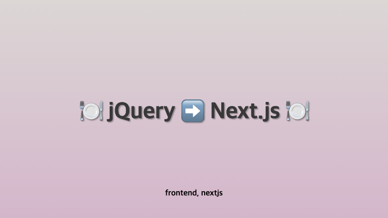
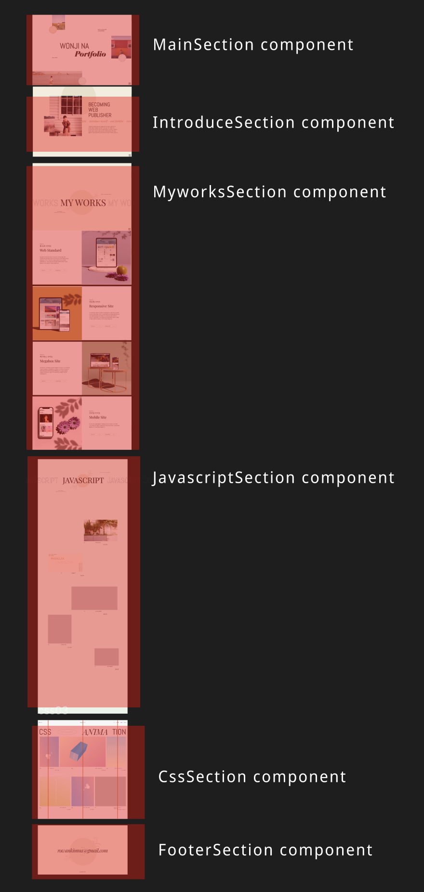
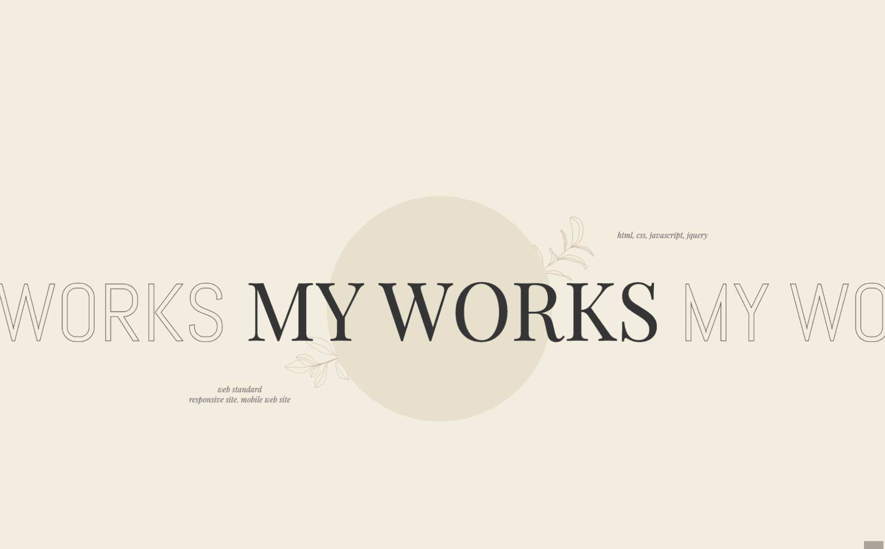
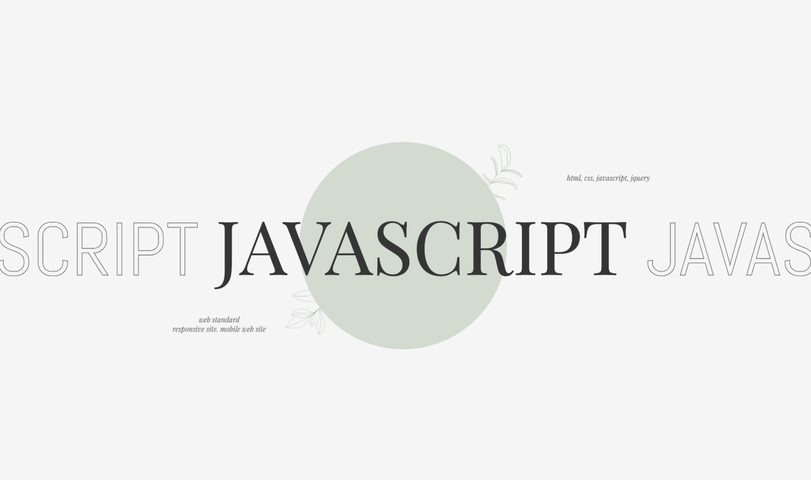
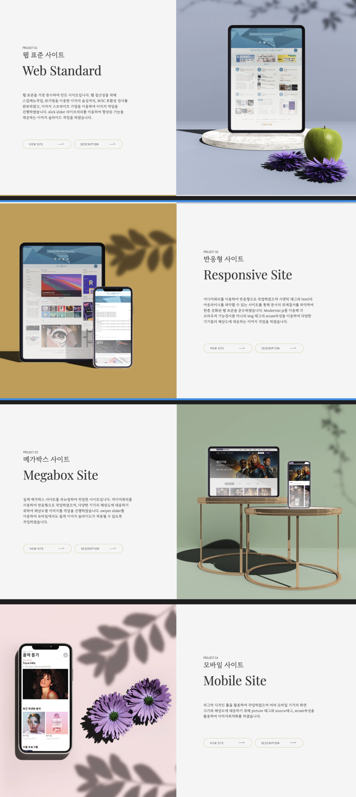
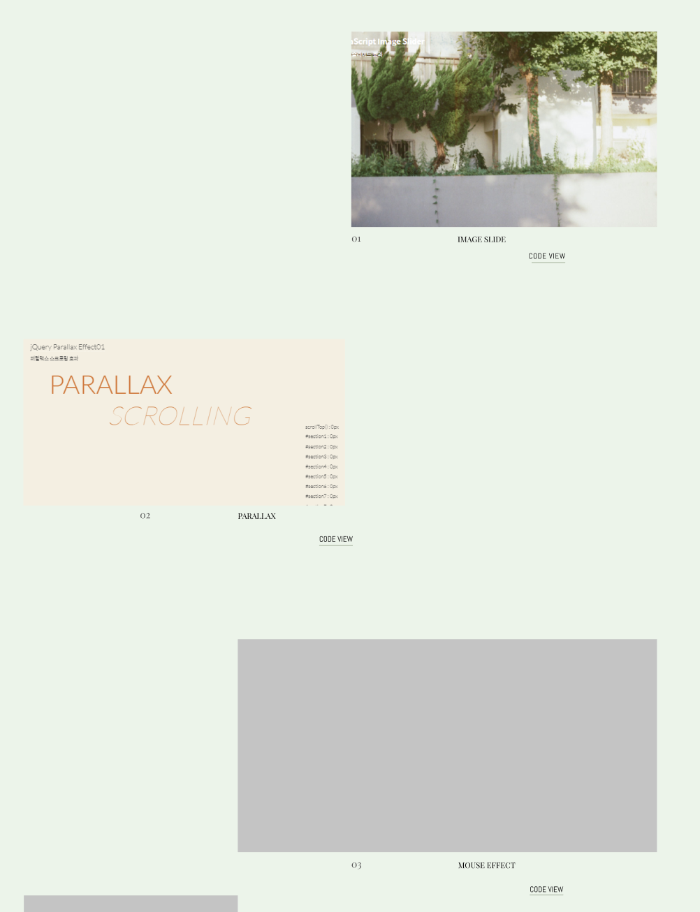
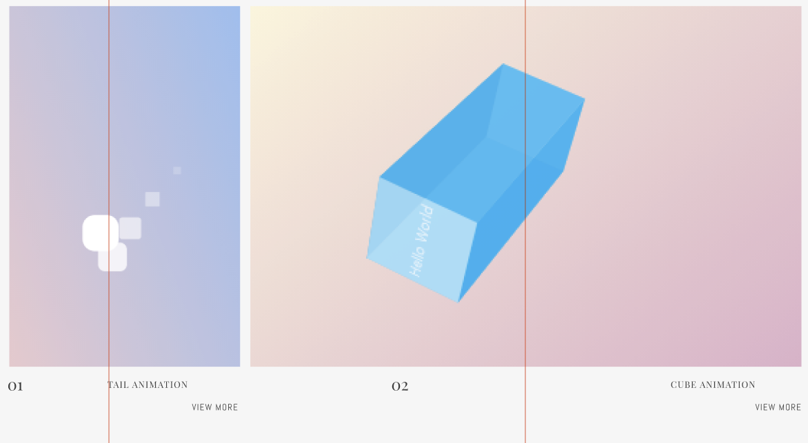
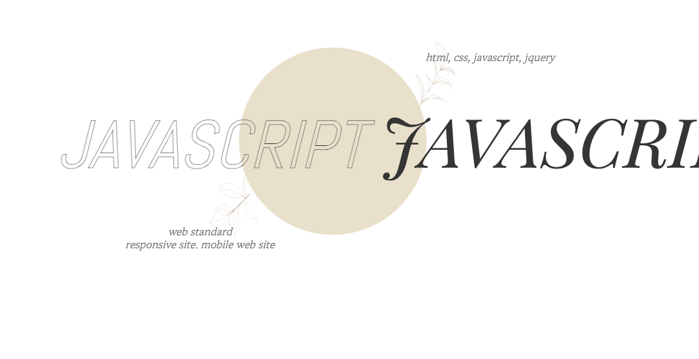
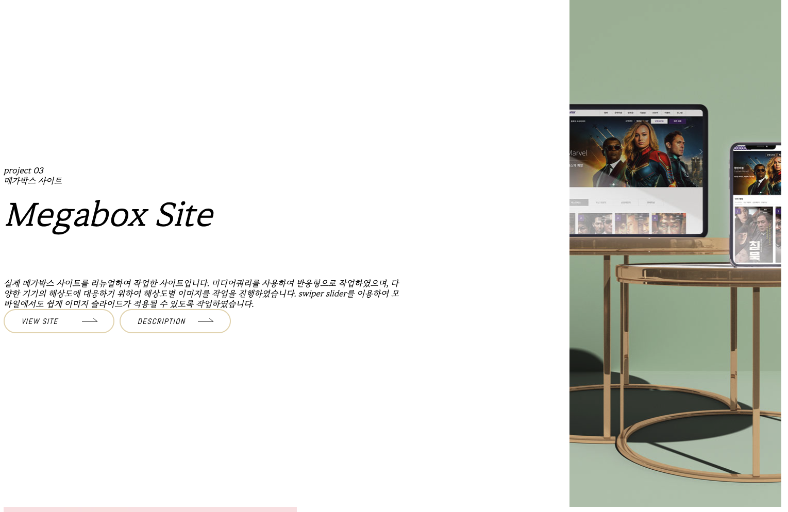

**2020년 취업 초반에 만들었던 jQuery 포트폴리오를 Next.js로 업그레이드하면서 적는 Next.js 고군분투기**

<!-- truncate -->

[https://aainterior.com.ua/](https://aainterior.com.ua/)를 클론코딩한 사이트 입니다.

## 🍽️ 기존 프로젝트에서의 컴포넌트

기존 프로젝트에서는 컴포넌트라는 개념이 없었습니다. 그냥 생 html.....  
그래서 어쩌면 공통된 ui나 부분들도 노가다로 작성했던 기억이 나요.  
디자인 적인 요소가 많은 프로젝트이다보니, 공통적으로 컴포넌트화 할 것들이 많진 않지만  
오히려 잘 됐다고 생각했습니다. 작은 규모부터 컴포넌트화를 시켜보면 연습이 될 테니까요.

## 🍽️ 컴포넌트화가 필요하다고 생각한 이유

my works나 javascript, css 작업물들을 나열한 부분들을 보면, 내용이 추가될 때마다 html을 추가해줘야하는 번거로움이 있겠다 생각했습니다.  
html+css 템플릿을 컴포넌트화 하고, 관련 내용들은 json으로 관리하는게 적절하다고 판단했습니다.

## 🍽️ 기존 프로젝트 코드 분석 - 컴포넌트화 할 수 있는 부분을 찾아보자!

### Section별로 컴포넌트 나누기



### 섹션 제목부분




공통적으로 디자인이 동일하고, 다른 것은 텍스트와 컬러밖에 없기 때문에 컴포넌트화에 용이하다고 생각했습니다.

### my works의 사이트 소개부분



좌우로 이미지 위치가 달라지는 변경점이 있지만, props로 값을 보내 css를 변경시키면 되겠다고 판단했어요.  
컴포넌트를 구성하는 데이터들은 mdx나 json으로 만들어야겠다고 생각했습니다.

### javascript, css > import한 부분 각각




공통적으로 디자인 템플릿이 동일하여 한 컴포넌트로 만들고 props로 상세한 css 설정과 데이터를 넣어주어야겠다고 생각했습니다.

## 🍽️ Next.js 컴포넌트 파일 구조 설계

```
/app
├── layout.tsx
├── page.tsx
├── components/ # ✅ 컴포넌트 모음 폴더
│ ├── ui/       # ✅ (1) UI 공통 컴포넌트
│ │ ├── Button/ # ✅ Button 컴포넌트 폴더
│ │ │ ├── Button.tsx
│ │ │ └── Button.module.css
│ │ └── index.ts # UI 컴포넌트들을 한 번에 export
│ │
│ ├── layout/   # ✅ (2) 레이아웃 관련 컴포넌트
│ │ ├── Header/ # ✅ Header 컴포넌트 폴더
│ │ │ ├── Header.tsx
│ │ │ └── Header.module.css
│ │ ├── Footer/ # ✅ Header 컴포넌트 폴더
│ │ │ ├── Footer.tsx
│ │ │ └── Footer.module.css
│ │ └── index.ts
│ │
│ ├── sections/ # ✅ (3) 특정 페이지에 포함되는 섹션 컴포넌트
│ │ ├── Main/   # ✅ Main 컴포넌트 폴더
│ │ │ ├── Main.tsx
│ │ │ └── Main.module.css
│ │ ├── Info/   # ✅ Info 컴포넌트 폴더
│ │ │ ├── Info.tsx
│ │ └─└── Info.module.css
│ └── index.ts # 모든 컴포넌트들을 한 번에 export
│
├── styles/ # 전역 스타일
├── public/ # 정적 파일 (이미지, 폰트 등)
└── ...
```

컴포넌트들은 components 파일 하위에 존재할 수 있도록 지정했습니다.  
작은 ui단위의 공통컴포넌트는 `app/components/ui`폴더로,  
레이아웃단위의 공통컴포넌트는 `app/components/layout`폴더로,  
큰 섹션단위의 공통컴포넌트는 `app/components/section`폴더로 지정했습니다.

## 🍽️ 컴포넌트 변환 과정

### 섹션 container 레이아웃 `SectionContainer` 만들어주기

```html title="수정 전 html"
<section id="section2">
  <div class="row">
    <div class="container">
      <div class="sec2">. .여기서부터 콘텐츠 시작! . .</div>
    </div>
  </div>
</section>
```

공통적으로 myworks, javascript, css 섹션부분의 html에 레이아웃을 잡기 위한 `container`가 설정되어 있었습니다.

이는 header와 footer단위의 큰 레이아웃은 아니지만, `section`안에 사용되는 공통된 레이아웃이라서, 레이아웃 폴더에 반영해주었어요.

row는 양 옆에 패딩이 설정되어 있는 클래스였는데, container와 역할을 다르게 할 필요가 없어서 container안에 병합해 주었습니다.

다음은 공통 container를 적용한 `SectionContainer`컴포넌트 입니다.

```tsx title="src/app/components/layout/SectionContainer/SectionContainer.tsx"
import { ReactNode } from "react";
import styles from "./SectionContainer.module.css";
export default function Container({
  children,
  sectionId,
}: {
  children: ReactNode;
  sectionId: string;
}) {
  return (
    <>
      <section id={sectionId} className={styles[sectionId]}>
        <div className={styles.container}>{children}</div>
      </section>
    </>
  );
}
```

```tsx title="src/app/components/sections/IntroduceSection/IntroduceSection.tsx"
import SectionContainer from "@/app/components/layout/SectionContainer/SectionContainer";

export default function IntroduceSection() {
  return (
    <>
      <SectionContainer sectionId={"section2"}>
        <div className="sec2">. . . 내용 시작!</div>
      </SectionContainer>
    </>
  );
}
```

`SectionContainer` 컴포넌트를 적용하였습니다.

### `TitleSection` 만들기



공통된 디자인에 제목만 달라서 컴포넌트화 해주었는데요,
TitleSection.tsx은 다음과 같습니다.

```tsx title="src/app/components/sections/TitleSection/TitleSection.tsx"
import SectionContainer from "@/app/components/layout/SectionContainer/SectionContainer";
import styles from "./TitleSection.module.css";

import Image from "next/image";
import LeftImg from "@/public/img/leaf_left.png";
import RightImg from "@/public/img/leaf_right.png";

export default function TitleSection({
  titleSectionId,
  titleSectionClass,
  title,
}: {
  titleSectionId: string;
  titleSectionClass: string;
  title: string;
}) {
  return (
    <>
      <SectionContainer sectionId={titleSectionId}>
        <div className={styles[titleSectionClass]}>
          <h2 className={styles.sec3_h2}>
            {title} <strong className={styles.sec3_h2_strong}>{title}</strong>{" "}
            {title}
          </h2>
          <span className={`${styles.sec3_span} ${styles.sec3_left_text}`}>
            <span className={styles.sec3_left_text_span}>web standard</span>
            responsive site. mobile web site
          </span>
          <span className={`${styles.sec3_span} ${styles.sec3_right_text}`}>
            html, css, javascript, jquery
          </span>
          <div className={styles.tit_bgcircle} aria-hidden="true"></div>
          <Image
            aria-hidden="true"
            className={styles.rightLeaf}
            src={RightImg}
            alt="rightLeaf"
          />
          <Image
            aria-hidden="true"
            className={styles.leftLeaf}
            src={LeftImg}
            alt="leftLeaf"
          />
        </div>
      </SectionContainer>
    </>
  );
}
```

적용본은 다음과 같습니다.

```tsx
"use client";
import TitleSection from "@/app/components/sections/TitleSection/TitleSection";

export default function MyWorksSection() {
  return (
    <>
      <TitleSection
        titleSectionId={"section3"}
        titleSectionClass={"sec3"}
        title="my works"
      ></TitleSection>
  )
}

```

### `MyworksSection`, `javascriptSection`, `cssSection` json으로 데이터 만들기

`MyworksSection`, `javascriptSection`, `cssSection`은 확장성을 고려하여 데이터들을 json으로 만들고 map을 돌려서 뿌려줘야겠다고 생각했습니다.
json 파일은 `src/public`에 json 폴더를 만들어 위치시켜 준 뒤 다음과 같이 적용해 주었습니다.

```tsx title="src/app/components/sections/MyWorksSection/MyWorksSection.tsx"
import SectionContainer from "@/app/components/layout/SectionContainer/SectionContainer";
import TitleSection from "@/app/components/sections/TitleSection/TitleSection";
import styles from "./MyWorksSection.module.css";
import { works } from "@/public/json/myWorksData.json";

export default function MyWorksSection() {
  return (
    <>
      <TitleSection
        titleSectionId={"section3"}
        titleSectionClass={"sec3"}
        title="my works"
      ></TitleSection>

      <SectionContainer sectionId={"section4"}>
        //highlight-start
        {works.map(
          ({
            id,
            subTitle,
            title,
            backgroundURL,
            desc,
            siteLink,
            descLink,
          }) => (
            <div key={id} className={`${styles.my}`}>
              <div
                style={{
                  background: `url(${backgroundURL}) no-repeat center/cover`,
                }}
                className={styles.works_img}
                aria-label={desc}
              ></div>
              <div className={styles.works_desc_wrap_show}>
                <div className={styles.works_desc_wrap_works_desc}>
                  <span className={styles.works_desc_wrap_works}>
                    project {id < 10 ? `0${id}` : id}
                  </span>
                  <h3 className={styles.works_desc_wrap_works_desc_h3_show}>
                    {subTitle}
                    <strong
                      className={styles.works_desc_wrap_works_desc_h3_strong}
                    >
                      {title}
                    </strong>
                  </h3>
                  <p className={styles.works_desc_wrap_works_desc_p_show}>
                    {desc}
                  </p>
                  <div>
                    <a
                      className={styles.works_desc_wrap_works_desc_works_btn_a}
                      href={siteLink}
                      target="_blank"
                    >
                      <strong
                        className={
                          styles.works_desc_wrap_works_desc_works_btn_a_strong
                        }
                      >
                        view site
                      </strong>
                      <span
                        className={
                          styles.works_desc_wrap_works_desc_works_btn_a_arrow
                        }
                        aria-hidden="true"
                      ></span>
                    </a>
                    <a
                      className={styles.works_desc_wrap_works_desc_works_btn_a}
                      href={descLink}
                      target="_blank"
                    >
                      <strong
                        className={
                          styles.works_desc_wrap_works_desc_works_btn_a_strong
                        }
                      >
                        description
                      </strong>
                      <span
                        className={
                          styles.works_desc_wrap_works_desc_works_btn_a_arrow
                        }
                        aria-hidden="true"
                      ></span>
                    </a>
                  </div>
                </div>
              </div>
            </div>
          )
        )}
        //highlight-end
      </SectionContainer>
    </>
  );
}
```

json 데이터는 다음과 같습니다.

```json title="src/public/json/myWorksData.json"
{
  "works": [
    {
      "id": 1,
      "subTitle": "웹 표준 사이트",
      "title": "Web Standard",
      "backgroundURL": "/myworks01.jpg",
      "desc": "웹 표준을 가장 준수하여 만든 사이트입니다. 웹 접근성을 위해 스킵메뉴작업, IR기법을 이용한 이미지 숨김처리, W3C 호환성 검사를 완료하였고, 이미지 스프라이트 기법을 이용하여 이미지 작업을 진행하였습니다. slick slider 라이브러리를 이용하여 향상된 기능을 제공하는 이미지 슬라이드 작업을 하였습니다.",
      "siteLink": "",
      "descLink": "https://www.notion.so/Web-standard-39d3df460a42439f84a01e86f8e8b6e1"
    },
    {
      "id": 2,
      "subTitle": "반응형 사이트",
      "title": "Responsive Site",
      "backgroundURL": "/myworks02.jpg",
      "desc": "미디어쿼리를 이용하여 반응형으로 작업하였으며 시맨틱 태그와 html의 아웃라이너를 파악할 수 있는 사이트를 통해 문서의 위계질서를 파악하여 한층 강화된 웹 표준을 준수하였습니다. Modernizr.js를 이용해 각 브라우저 기능검사뿐 아니라 img 태그의 srcset속성을 이용하여 다양한 기기들의 해상도에 대응하는 이미지 작업을 하였습니다.",
      "siteLink": "",
      "descLink": "https://www.notion.so/Responsive-site-4774617110ad48949a1791a785f2de1d"
    },
    {
      "id": 3,
      "subTitle": "메가박스 사이트",
      "title": "Megabox Site",
      "backgroundURL": "/myworks03.jpg",
      "desc": "실제 메가박스 사이트를 리뉴얼하여 작업한 사이트입니다. 미디어쿼리를 사용하여 반응형으로 작업하였으며, 다양한 기기의 해상도에 대응하기 위하여 해상도별 이미지를 작업을 진행하였습니다. swiper slider를 이용하여 모바일에서도 쉽게 이미지 슬라이드가 적용될 수 있도록 작업하였습니다.",
      "siteLink": "",
      "descLink": "https://www.notion.so/Megabox-site-a3e68dc6928d47d4a234c77b8c23a6da"
    },
    {
      "id": 4,
      "subTitle": "모바일 사이트",
      "title": "Mobile Site",
      "backgroundURL": "/myworks04.jpg",
      "desc": "피그마 디자인 툴을 활용하여 작업하였으며 여러 모바일 기기의 화면 크기와 해상도에 대응하기 위해 picture 태그와 source태그, srcset속성을 활용하여 이미지최적화를 하였습니다.",
      "siteLink": "",
      "descLink": "https://www.notion.so/Mobile-Site-7847cf91e1474787a3eb79d5d3ec398a"
    }
  ],
  "javasciprt": [
    {
      "id": 1,
      "subTitle": "웹 표준 사이트",
      "title": "Web Standard",
      "backgroundURL": "/myworks01.jpg",
      "desc": "웹 표준을 가장 준수하여 만든 사이트입니다. 웹 접근성을 위해 스킵메뉴작업, IR기법을 이용한 이미지 숨김처리, W3C 호환성 검사를 완료하였고, 이미지 스프라이트 기법을 이용하여 이미지 작업을 진행하였습니다. slick slider 라이브러리를 이용하여 향상된 기능을 제공하는 이미지 슬라이드 작업을 하였습니다.",
      "siteLink": "",
      "descLink": "https://www.notion.so/Web-standard-39d3df460a42439f84a01e86f8e8b6e1"
    }
  ]
}
```

## 🍽️ jQuery에서 next.js로 컴포넌트화, css적용하면서 문제를 겪은 부분

### 이미지가 나오지 않는 문제


`myWorksSection`에서 이미지는 `img`태그로 한 것이 아닌 `css backgroundimage`로 적용한 것입니다. 경로를 `json`에서 동적으로 끌고 와야한 상황이었고 css파일에서 일일히 적용해줄 수 없는 상황이었는데요. `inline`으로 스타일을 지정하고 이미지는 `src/public`이 아닌 제일 루트에 있는 `public`폴더에 넣어 이미지가 렌더 되게하였습니다.

## 🍽️ 결과물 보기

아직 진행중입니다. 다음 포스팅에선 css 개선을 해볼거에요.  
[https://nextjs-portfolio-migration.vercel.app/](https://nextjs-portfolio-migration.vercel.app/)
