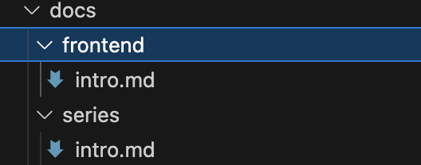
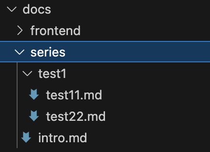
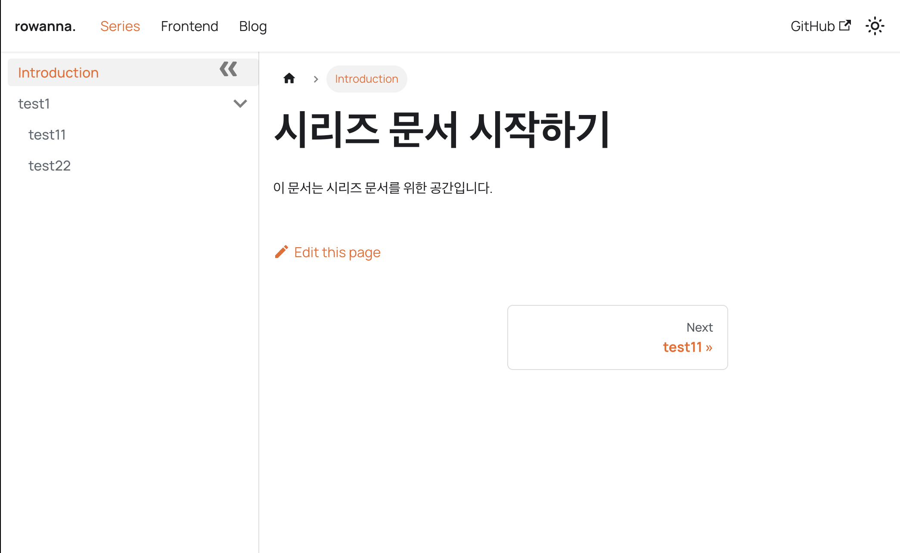

**docusaurus에서 여러개의 docs를 만들고 path에 docs를 제외하고 커스텀한 이름으로 path를 지정해봅시다**

<!-- truncate -->

## 🫧 들어가며


docusaurus블로그에서 다음과 같이 Docs가 아닌 여러개의 문서페이지를 만들고 싶다고 가정하고 튜토리얼을 제공하는 글입니다.
제가 만들 페이지는 series, frontend 두개의 페이지 입니다.

## 🫧 문서 폴더 만들기

우선 docs폴더 하위에 원하는 이름을 넣어 폴더를 만듭니다.
저는 series, frontend라는 폴더를 만들었습니다.



## 🫧 docusaurus.config.ts에서 설정하기

### presets을 사용하는 방법으로 문서다수인스턴스(`docs-multi-instance`) 설정하기

`docs-multi-instance`는 preset을 사용하는 방법과 preset을 이용하지 않는 방법이 있는데요,  
preset을 이용하지 않는 방법으로 했더니 오류가 잘 나서 preset을 이용하는 방법으로 소개하겠습니다.  
presets > docs에서는 기본적으로 사용할 docs를 설정할 수 있습니다.

```ts title="docusaurus.config.ts"
export default {
  presets: [
    [
      "@docusaurus/preset-classic",
      {
        docs: {
          // id: 'product', // 따로 설정하지 않으면 'default'로 지정됩니다.
          path: "docs/series", // 임포트 될 폴더의 경로
          routeBasePath: "series", // 적용될 route
          sidebarPath: "./sidebars.ts",
          // ... other options
        },
      },
    ],
  ],
  plugins: [
    [
      "@docusaurus/plugin-content-docs",
      {
        id: "frontend",
        path: "docs/frontend", // 임포트 될 폴더의 경로, 설정된 이 폴더 내 문서가 관리됩니다.
        routeBasePath: "frontend",
        sidebarPath: "./frontendSidebars.ts", // 사이드 바를 따로 생성해주어야 합니다.
        // ... other options
      },
    ],
  ],
};
```

에러를 많이 겪으며 깨달은 주의할 점은 다음과 같습니다.

- id를 설정하지 않으면 자동적으로 'default'로 설정됩니다.
- 우리는 docs 하위에 폴더를 만들었기 때문에 path 란에 docs/폴더이름 을 지정해야 합니다.
- sidebarPath에 각각 다른 사이드바 파일을 만들어 지정해주어야 합니다.

### 접근할 수 있게 navbar에서 설정해주기

```ts
export default {
  themeConfig: {
    navbar: {
      items: [
        //highlight-start
        {
          type: "docSidebar",
          sidebarId: "series", // 위에서 설정한 "./sidebars.ts" 에서 쓰는 id 값으로 지정해야합니다.
          position: "left",
          label: "Series",
          // to 가 없는 이유 : default로 설정되었기 때문.
        },
        {
          type: "docSidebar",
          sidebarId: "frontendSidebar", // 위에서 설정한 "./frontendSidebars.ts" 에서 쓰는 id 값으로 지정해야합니다.
          position: "left",
          label: "Frontend",
          to: "/frontend",
          docsPluginId: "frontend", // docs plugin으로 생성한 메뉴는 이 부분을 생성해야 합니다. plugins의 id로 지정하면 됩니다.
        },
        //highlight-end
      ],
    },
  },
};
```

주의해야할 점은 다음과 같습니다.

- preset으로 지정된 default docs는 따로 to를 지정해줄 필요가 없습니다.
- 공통적으로 sidebarId를 지정해주어야 합니다.(설정한 사이드바 파일에서 설정된 아이디 값)
- docs plugin으로 생성한 메뉴는 `docsPluginId`를 설정해 주어야 합니다.

## 🫧 사이드바 파일 설정하기

사이드바를 설정해줍시다.
저는 프로젝트 루트에 파일을 위치해주었고 다음과 같이 설정했습니다.

```ts
import type { SidebarsConfig } from "@docusaurus/plugin-content-docs";

const sidebars: SidebarsConfig = {
  series: [
    {
      type: "autogenerated",
      dirName: ".", // Generate sidebar slice from docs/api
    },
  ],
};

export default sidebars;
```

- 여기에선 `series`가 sidebarId 값입니다.

## 잘 만들어지는 지 확인

다음과 같이 설정해주고 이제 문서 파일을 만들어 카테고리가 생기는 지 테스트 해 봅시다.
다음 구조대로 저는 파일을 만들어 주었습니다.





잘 만들어진 것으로 확인되었습니다!

## 출처

- [docusaurus docs-multi-instance](https://docusaurus.io/docs/docs-multi-instance)
