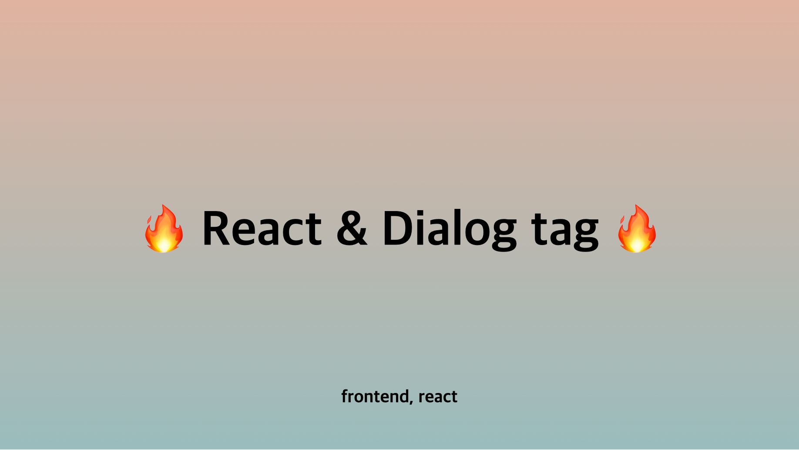
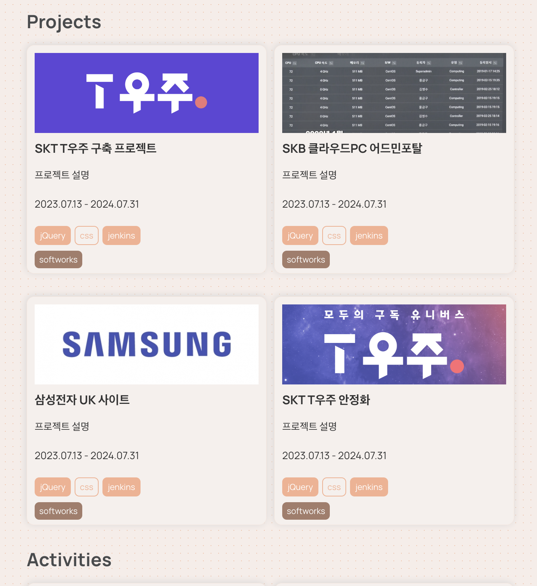

**모달을 만들기 위해 `dialog` 태그를 사용해보고 `CSS`로 `body` 태그의 스크롤 막기 작업도 해봅시다.**

<!-- truncate -->

## 🔥 들어가며

이번에 [about페이지](/about)를 개발하면서 modal을 만들 일이 있었습니다.  
다음 UI를 클릭하면 모달이 뜨게끔 개발하고 싶었는데요,

ASAC 07기에서 배운 `dialog` 태그를 이용해서 작업했는데,  
좀 더 나은 UX를 위해 추가적으로 작업해야할 것들이 있어서  
방법론처럼 정리해서 알아두면 좋을 것 같아 기록해보려 합니다.

## 🔥 dialog 적용하기

우선 `dialog`를 적용해봅시다.  
`dialog`에 데이터는 다음과 같은 플로우로 전달됩니다.

### 1. 클릭한 요소에서 `openDialog`을 할 때 함수 파라미터로 `work`를 보냄.

### 2. 그 `work`를 `dialogData` 관리함.

### 3. `openDialog` 했을 때 `setDialogData`로 설정해줌.

```tsx title="index.tsx"
import { projects } from "../../../static/json/projects.json";

export default function About(): ReactNode {
  const dialogRef = useRef(null);
  const [dialogData, setDialogData] = useState<MyObject | null>({});
  //highlight-start
  const openDialog = (e, works) => {
    const current = dialogRef.current ?? document.createElement("dialog");

    setDialogData(() => works);

    if (!current) return;

    current.showModal();
  };
  //highlight-end
  const closeDialog = (e) => {
    const current = dialogRef.current ?? document.createElement("dialog");

    if (!current) return;
    if (e.target.nodeName === "DIALOG" || e.target.nodeName === "BUTTON") {
      current.close();
    }
  };

  return (
    <div>
      {projects.map((project) => (
        <div
          key={project.id}
          //highlight-start
          onClick={(e) => openDialog(e, project)}
          //highlight-end
          className={styles.work_card_item}
        >
          <button>
            <div
              style={{
                background: `url(${project.backgroundImgUrl}) no-repeat center/cover`,
                width: "100%",
                height: "300px",
              }}
            ></div>
            <div className={styles.item_desc}>
              <h3>{project.title}</h3>
              <p>{project.short_desc}</p>
              <p>{project.date}</p>
              <div className={styles.tag_wrap}>
                {project.tags.map((tag) => (
                  <span>{tag}</span>
                ))}
              </div>
              <div className={styles.type}>
                <span>{project.type}</span>
              </div>
            </div>
          </button>
        </div>
      ))}
    </div>
  );
}
```

### 4. state `dialogData` 로 접근하여 `dialog`에 뿌려줌.

```tsx
<dialog
  onClick={(e) => closeDialog(e)}
  className={styles.about_dialog}
  ref={dialogRef}
>
  <div
    style={{
      background: `url(${dialogData.backgroundImgUrl}) no-repeat center/cover`,
      width: "100%",
      height: "300px",
    }}
  ></div>
  <div className={styles.dialog_item_desc}>
    <h1>{dialogData.title}</h1>
    <p>{dialogData.short_desc}</p>
    <p>{dialogData.long_desc}</p>
    <p>{dialogData.date}</p>
    <div className={styles.tag_wrap}>
      {dialogData?.tags?.map((tag) => (
        <span>{tag}</span>
      ))}
    </div>
    <div className={styles.type}>
      <span>{dialogData.type}</span>
    </div>
  </div>
  <button onClick={(e) => closeDialog(e)}>Close</button>
</dialog>
```

다 적용된 모습은 다음과 같습니다.


하지만 gif에서 보면 알 수 있듯이 뒷 배경이 스크롤되는 걸 볼 수 있죠.
이는 예전에는 `javascript`로 설정해주어야 했습니다.
하지만 이는 `css` 만으로도 개선할 수 있습니다.

## 🔥 UX 개선하기

뒷 배경이 스크롤되는 문제는 `css`만으로도 개선할 수 있습니다.

```css
body:has(dialog[open]) {
  overflow: hidden !important;
}
```
