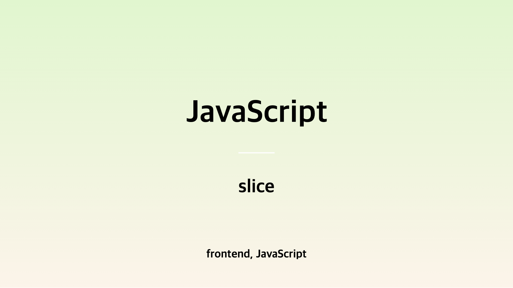

**알고리즘을 풀면서 어떤 경우에 slice를 쓰면 효율적일까? slice()를 무조건 쓰는 게 성능에 좋은걸까?**

<!-- truncate -->

## 📝 들어가며

이 섹션의 첫 글을 slice로 정한 것은 [`문자열 겹쳐쓰기`](https://school.programmers.co.kr/learn/courses/30/lessons/181943) 문제를 풀면서 본 더 나은 풀이방법 때문이었습니다.

다른 사람의 풀이 중 `slice`를 활용해 한 줄로 풀이를 마친 답안이었는데요,
답안은 다음과 같습니다.

```js
function solution(my_string, overwrite_string, s) {
  return (
    my_string.slice(0, s) +
    overwrite_string +
    my_string.slice(s + overwrite_string.length)
  );
}
```

`slice`가 문자열이나 배열을 "자른다" 정도로만 인식하고 있었어서, 정확히 어떤값을 리턴하고 어떻게 쓰는지에 대해서는 몰랐기 때문에 이번 기회에 사용법과 어떤 알고리즘 패턴에서 활용할 수 있을지, 실무에서 쓸 수 있을 만한 상황까지 정리해보려 합니다.

## 📝 slice()의 기본 개념

### 기본 사용 방법

```
array.slice(start, end)
```

```js
const arr = ["ant", "bison", "camel", "duck", "elephant"];

console.log(arr.slice(2));
// Expected output: Array ["camel", "duck", "elephant"]
```

어떤 배열의 start index부터 end index의 바로 앞 요소 까지에 대한 얕은 복사본을 새로운 배열 객체로 반환하며, **원본 배열은 바뀌지 않습니다.** start index값만 있으면 배열 끝까지 출력됩니다.

### slice(start, end)에서 end가 포함되지 않는다.

slice()의 동작 방식에 대한 시각적 자료 추가

slice(start, end)에서 end가 포함되지 않는 이유를 설명할 때, 문자열이나 배열을 인덱스별로 나눈 다이어그램을 넣으면 직관적으로 이해하기 좋을 것 같아.
예를 들어, "abcdef".slice(1, 4)의 결과를 ['b', 'c', 'd']로 시각화해서 설명.

### 문자열 앞/뒤 일부 제거

### 특정 범위만 선택하는 다양한 예제

### 배열에서 마지막 N개 요소 가져오기 (arr.slice(-N))

### 배열, 문자열 얕은 복사

## 📝 헷갈릴 수 있는 메서드 slice() vs splice()

slice()는 원본을 변경하지 않는 반면, splice()는 원본을 변경
slice()는 부분을 잘라서 반환, splice()는 제거 및 추가 가능
예제 코드 비교

### 예제 코드 비교

비교 예제 코드를 좀 더 구체적으로 정리하면 좋아.
slice()와 splice()가 실제로 다르게 동작하는 예제를 직접 실행할 수 있도록 정리.
특히, splice()가 원본을 변경하는 경우와 slice()가 새 배열을 반환하는 점을 강조.

```js
let arr = [1, 2, 3, 4, 5];

console.log(arr.slice(1, 3)); // [2, 3] (원본 유지)
console.log(arr); // [1, 2, 3, 4, 5]

console.log(arr.splice(1, 3)); // [2, 3, 4] (원본 변경)
console.log(arr); // [1, 5]
```

## 📝 slice()를 이용해 [`문자열 겹쳐쓰기`](https://school.programmers.co.kr/learn/courses/30/lessons/181943) 풀어보기

### for문을 활용한 전통적인 방식 vs slice() 활용 방식 비교

확실히 slice를 활용하는 게 가독성과 퍼포먼스가 향상되는 게 확연히 드러납니다.

## 📝 slice()와 활용 팁

### map과 filter와의 활용 팁

slice()가 원본을 변경하지 않기 때문에 map(), filter() 같은 메서드와 조합하기 좋은데, 어떻게 활용하면 좋을지 아래에서 이야기해보겠습니다.

#### slice()룰 먼저 사용하여 map()의 연산 범위 줄이기

데이터가 100만개라고 가정할 때, 그 중 10만개만 연산한다고 해봅시다.

### 실전 프론트엔드 예제

1️⃣ 페이지네이션 (Pagination) 구현  
2️⃣ 배열에서 특정 구간의 요소 필터링

## 📝 slice()의 성능과 성능최적화 관점에서 주의해야할 점

위에서 확인해 본 결과 for loop로 구현한 로직을 slice()로 구현했더니 가독성과 퍼포먼스가 크게 향상된 게 확인 되었습니다. 그럼 slice()는 성능이 무조건 좋다고 할 수 있을까요?
slice()를 성능최적화 관점에서 바라본 아티클에서 내용을 참조해 내용을 정리해보았습니다.

### slice()의 성능 측정

다음은 대량의 데이터를 받아와서 정해진 chunk갯수대로 나누는 로직입니다.
slice와 for문으로 구현하여 performance를 측정해보았습니다.

```js
const dataSize = 1_000_000; // 100만 개 데이터 생성
const chunkLength = 100000; // 10만개씩 끊기
const largeArray = Array.from({ length: dataSize }, (_, i) => i);

// ✅ 1. slice() 사용
const startSlice = performance.now();
const slicedArray = largeArray.slice(0, chunkLength);
const endSlice = performance.now();

console.log(`slice() 실행 시간: ${(endSlice - startSlice).toFixed(2)}ms`);
console.log(`slice() 결과 배열 길이: ${slicedArray.length}\n`);

// ✅ 2. for 루프 사용 (새로운 배열 직접 생성)
const startFor = performance.now();
const newArray = [];
for (let i = 0; i < chunkLength; i++) {
  newArray.push(largeArray[i]);
}
const endFor = performance.now();

console.log(`for 루프 실행 시간: ${(endFor - startFor).toFixed(2)}ms`);
console.log(`for 루프 결과 배열 길이: ${newArray.length}`);
```

performance는 slice가 더 우수합니다.
실행시간이 slice가 더 빠르다는 얘기죠.
하지만 slice는 새 배열을 만들기 때문에 메모리를 더 많이 사용합니다.

### 성능최적화 관점에서 주의해야할 점

#### 메모리 사용량 관점

#### 배열에서 반복적인 slice() 사용

#### arguments 객체에서 slice()의 대안책

#### 결론 : slice()를 무조건 사용하면 안된다라든지, 무조건 사용하는게 답이다라는 건 아니다.

최적화방법이라는 건 상황에 따라 다릅니다. 상황에 따라 최적화 방법이 다 다르기 때문에, 어떤 경우에는 코드를 간결하게 유지하기 위해 slice()를 사용하는 것이 유지보수에 유리할 수도 있습니다. 따라서 위처럼 성능 테스트를 해보면서 가장 적합한 방법을 선택하는 것이 중요합니다. 또한 상황에 따라, 비즈니스적인 관점에서도 고려하고 유지보수의 상황까지 고려하여 성능최적화를 하는 게 적절한 방법인 것 같습니다.

## 출처

- [slice mdn](https://developer.mozilla.org/ko/docs/Web/JavaScript/Reference/Global_Objects/Array/slice)
- [modern javascript 배열과 메서드](https://ko.javascript.info/array-methods)
- [자바스크립트 배열의 slice()와 splice() 함수](https://www.daleseo.com/js-array-slice-splice/)
- [Optimisation issues with Array.slice()](https://hemanthkollanur.medium.com/optimisation-issues-with-array-slice-b075e7a6e5e7)
