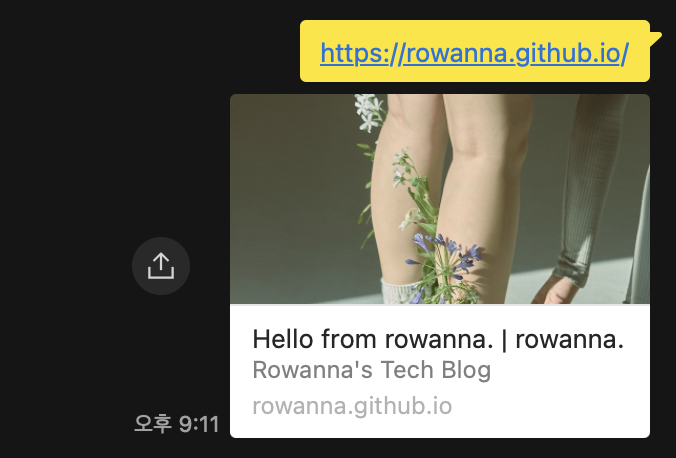

docusaurus.config.ts을 변경하여 상단 navbar, footer, meta tag를 설정해봅시다.

{/* truncate */}

배포에 성공했으면 블로그 커스텀을 시작해봅시다.

## 🤾 footer 설정하기

### logo 설정

```typescript
footer: {
    logo: {
        alt: 'Meta Open Source Logo',
        src: 'img/meta_oss_logo.png',
        href: 'https://opensource.fb.com',
        width: 160,
        height: 51,
    },
    copyright: `Copyright © ${new Date().getFullYear()} My Project, Inc. Built with Docusaurus.`,
},
```

src는 static 폴더를 기준으로 합니다.

### link 설정

link안에 아래의 객체 템플릿을 추가해서 여러 컬럼으로 링크를 구성할 수 있습니다.
컬럼 갯수에는 제한이 없습니다.

```typescript
  footer: {
    links: [
      {
        title: 'Docs',
        items: [
          {
            label: 'Style Guide',
            to: 'docs/',
          },
          {
            label: 'Second Doc',
            to: 'docs/doc2/',
          },
        ],
      },
      {
        title: 'Community',
        items: [
          {
            label: 'Stack Overflow',
            href: 'https://stackoverflow.com/questions/tagged/docusaurus',
          },
          {
            label: 'Discord',
            href: 'https://discordapp.com/invite/docusaurus',
          },
          {
            label: 'X',
            href: 'https://x.com/docusaurus',
          },
          {
            html: `
                <a href="https://www.netlify.com" target="_blank" rel="noreferrer noopener" aria-label="Deploys by Netlify">
                  
                </a>
              `,
          },
        ],
      },
    ],
  },
```

to 대신 href로 사용하면 새 창 열기 아이콘이 표시됩니다.

## 🤾 navbar 설정하기

### navbar 제목 설정하기

```ts
  themeConfig: {
    navbar: {
      title: "Site Title", // 사이트 이름
      logo: {
        alt: "Site Logo",
        src: "img/logo.svg", // static 폴더를 기준으로
        srcDark: "img/logo_dark.svg", // dark mode 일때의 src
        href: "https://docusaurus.io/",
        target: "_self",
        width: 32,
        height: 32,
        className: "custom-navbar-logo-class",
        style: { border: "solid red" },
      },
    },
  },
```

사이트의 이름 부분을 navbar부분에서 설정할 수 있습니다.
뿐만아니라 logo도 커스텀이 가능합니다.

### navbar link 설정하기

```ts
  themeConfig: {
    navbar: {
      items: [
        {
          type: "doc",
          position: "left",
          docId: "introduction",
          label: "Docs", // 아이템 이름
        },
        { to: "blog", label: "Blog", position: "left" },
        {
          type: "docsVersionDropdown",
          position: "right",
        },
        {
          type: "localeDropdown",
          position: "right",
        },
        {
          href: "https://github.com/facebook/docusaurus",
          position: "right",
          className: "header-github-link",
          "aria-label": "GitHub repository",
        },
        // // 현재 블로그 설정 예시 START (dropdown)
        {
          type: "dropdown",
          label: "Blog",
          position: "left",
          items: [
            {
              label: "Posts",
              href: "/blog",
            },
            {
              label: "Tags",
              href: "/blog/tags",
            },
          ],
        },
        // 현재 블로그 설정 예시 END
      ],
    },
  },
```

상단 navbar에 있는 link는 드롭다운 스타일도 제공합니다.
현재 제 블로그에 설정되어 있으니 참고하시면 됩니다.

### 검색 기능 설정하기

```ts
  themeConfig: {
    navbar: {
      items: [
        {
          type: "search",
          position: "right",
        },
      ],
    },
  },
```

### HTML 넣기

```ts
  themeConfig: {
    navbar: {
      items: [
        {
          type: "html",
          position: "right",
          value: "<button>Give feedback</button>",
        },
      ],
    },
  },
```

커스텀하여 링크를 구성할 수도 있습니다.

### 스크롤 시 hide 설정

```ts
themeConfig: {
    navbar: {
      hideOnScroll: true,
    },
  },
```

설정하게 되면 아래로 스크롤 시 navbar가 사라집니다.

## 🤾 메타태그 설정하기

사이트가 검색이 잘 되기 위해서는 메타태그 설정이 필수입니다.  
초반엔 docusaurus로 범벅이 되어있으니 자신만의 사이트를 구축하고 싶다면
읽어보시고 꼭 설정을 바꿔주세요!

### 메타 이미지 설정하기(카카오톡 미리보기 그거요)

```ts
export default {
  themeConfig: {
    image: "img/docusaurus.png", // 기본 경로는 static>img입니다.
  },
};
```

### 메타 정보 설정하기

```ts
    metadata: [
      {
        name: "keywords",
        content:
        // 검색했을 때 보이는 단어들
          "rowanna, frontend developer, wonjina, nawonji, 나원지, 프론트엔드개발, 깃허브블로그, rowannablog",
      },
      {name: 'twitter:card', content: 'summary'}
    ],
```

## 🤾 공유해보기



공유 하면 이렇게 뜬답니다!!
🫧🫧와아아~~~~~~🫧🫧

다음번에는 좀 더 상세한 블로그 커스텀으로 돌아오겠슴니다.

## 🤾 출처

[docusaurus site](https://docusaurus.io/docs/api/themes/configuration#codeblock)
