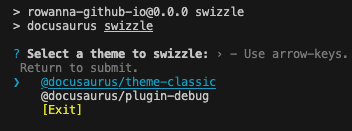
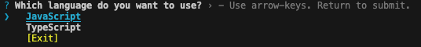
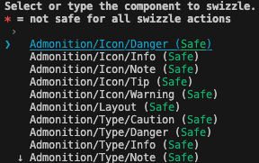
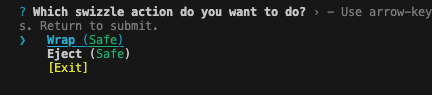
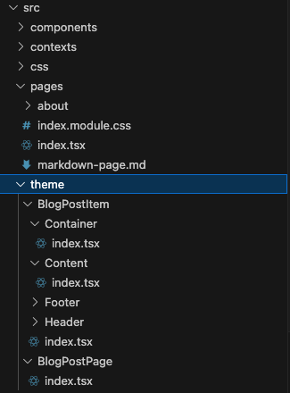
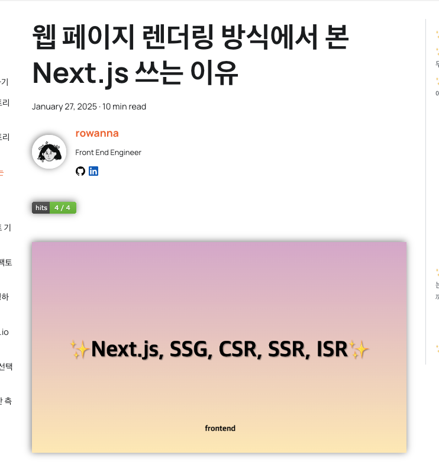
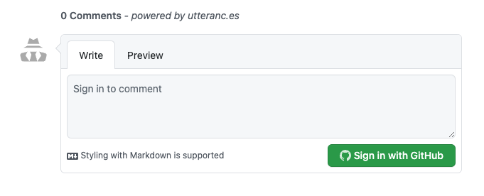

**Docusaurus블로그 `BlogPostItem` 컴포넌트에 swizzling으로 `utteranc` 댓글추가, `hits` 조회수 추가 기능을 추가해보자.**

<!-- truncate -->

블로그 글을 쓰다가 문득 블로그 글마다 얼마나 조회했는지, 또 댓글같은 반응은 어떤지를 보고 싶어졌습니다.  
docusaurus에서 자체적으로 제공하는 기능은 없어서 다른 기능을 써야했는데  
댓글 기능으로는 `utteranc`를 사용하기로, 조회 수 기능은 `hits`를 쓰기로 결정했습니다.

## 📝 `docusaurus swizzling`이란?

`docusaurus swizzling`이란 사용자 정의 레이아웃을 처리하는 방법입니다.  
즉, docusaurus에서 UI, 레이아웃 컴포넌트를 변경할 수 있는 기능인데요,  
작게는 버튼부터해서 크게는 페이지 구조까지 바꿀 수 있습니다.  
docusaurus로 만든 사이트를 마음대로 디자인이나 구조를 바꾸고 싶은 분들에게 적합한 기능이에요.

### `swizzling`❓ 이게 머여

`swizzling`이라는 개념이 확 와닿지 않아서 찾아보니,  
이런 개념은 개츠비(`Gatsby`)에도 `테마 쉐도잉`이라는 비슷한 개념이 있다고 하네요.  
테마에서 기본 컴포넌트보다 우선하는 대체 컴포넌트를 제공하는 것을 의미한다고 합니다.  
이는 `objective-C`와 `Swift UI`의 `method swizzling`에서 차용한 개념이라고 합니다.

## 📝 `swizzling` 실행하기

### `swizzling` 설치하기

```bash
npm install swizzle
```

### 컴포넌트 확인하기

swizzling을 실행하려면 먼저 어떤 컴포넌트가 있는지 확인해야합니다.  
링크로 들어가서 확인해도 되고 다음 명령어로 확인해도 됩니다.  
[swizzling 할 수 있는 컴포넌트 목록 보러가기](https://github.com/facebook/docusaurus/tree/main/packages/docusaurus-theme-classic/src/theme)

```bash
npm run swizzle -- --list

```

### `swizzling` 실행

```bash
npm run swizzle
```



위 명령어를 실행하면 다음과 같이 대화형 CLI가 나오는데요, 기본적으로 제공하는 테마는 theme-classic에 있어서 해당옵션을 선택해줍니다.

  
저는 typescript로 시작했기 때문에 typescript를 지정했습니다.

  
언어를 선택하면 swizzling할 컴포넌트를 선택하는데요, 저는 한참 내려서 BlogPostItem을 지정해줬습니다.

  
마지막으로 Wrap(감싸는)방식으로 할건지 Eject(추출)방식으로 할건지 물어보는데요,  
Wrap방식은 해당 컴포넌트를 컴포넌트 째로 받는것이고,  
Eject방식은 해당 컴포넌트의 내부코드와 함께 받는 것입니다.  
완전히 재정의를 하고싶고 갈아엎고 싶다면 Eject방식이 더 적합합니다.  
반면, 원래 있는 기능은 그대로 보존해두고, 더 향상시키고 싶다면 원본 테마 컴포넌트를 감싼 Wrap방식을 선택하는 게 좋습니다.

  
지정하면 이렇게 `src/theme` 폴더 하위에 변경가능한 컴포넌트의 새로운 폴더와 파일들이 생깁니다.

## 📝 `swizzling` 실행하지 않고도 컴포넌트 재정의가 가능합니다

바로 `src/theme` 폴더에 컴포넌트를 바로 만드는 것인데요,  
이렇게 하려면 docusaurus내부 로직에 이해도가 높아야 합니다.  
이 방식으로 하신다면 이 깃헙을 꼭 참고해 보세요  
[swizzling 할 수 있는 컴포넌트 목록 보러가기](https://github.com/facebook/docusaurus/tree/main/packages/docusaurus-theme-classic/src/theme)

## 📝 `BlogPostItem/Content` 컴포넌트에 `utteranc` 댓글기능 + `hits` 추가해보기

### 초기 코드

`Content/index.tsx`의 초기 설정은 다음과 같습니다.

```tsx title="src/theme/BlogPostItem/Content/index.tsx"
import React, { type ReactNode } from "react";
import clsx from "clsx";
import { blogPostContainerID } from "@docusaurus/utils-common";
import { useBlogPost } from "@docusaurus/plugin-content-blog/client";
import MDXContent from "@theme/MDXContent";
import type { Props } from "@theme/BlogPostItem/Content";

export default function BlogPostItemContent({
  children,
  className,
}: Props): ReactNode {
  const { isBlogPostPage } = useBlogPost();
  return (
    <div
      // This ID is used for the feed generation to locate the main content
      id={isBlogPostPage ? blogPostContainerID : undefined}
      className={clsx("markdown", className)}
    >
      <MDXContent>{children}</MDXContent>
    </div>
  );
}
```

### utteranc 에서 스크립트 태그 생성해오기

[utteranc사이트](https://utteranc.es/)에 가서 자신의 레포 이름을 적으면 하단에 스크립트 태그를 생성할 수 있는 칸이 나옵니다.

### utteranc 컴포넌트에 적용하기

몇 번 적용해보니 PostList에서 쓰이는 UI가 제목까지는 같기도 했고  
`isBlogPostPage`에 따라서 클래스가 바뀌는 것 같았어요.  
`isBlogPostPage`조건을 추가하지 않고 그냥 컴포넌트를 렌더링 시키니까 `BlogPostList`에서도 댓글창이 나오더라구요.  
그래서 해당조건을 기준으로 `utteranc` 댓글창이 보이게끔 설정해주었습니다.

```tsx title="src/theme/BlogPostItem/Content/index.tsx"
import React, { type ReactNode } from "react";
import clsx from "clsx";
import { blogPostContainerID } from "@docusaurus/utils-common";
import { useBlogPost } from "@docusaurus/plugin-content-blog/client";
import MDXContent from "@theme/MDXContent";
import type { Props } from "@theme/BlogPostItem/Content";
import { useLocation } from "@docusaurus/router";
import { useEffect } from "react";

// highlight-start
const UtterancesComments = () => {
  const { metadata } = useBlogPost();
  const commentRef = useRef<HTMLDivElement>(null);

  useEffect(() => {
    const script = document.createElement("script");
    script.src = "https://utteranc.es/client.js";
    script.setAttribute("repo", "rowanna/rowanna.github.io"); // GitHub 저장소 설정
    script.setAttribute("issue-term", "pathname"); // 게시글의 URL을 기준으로 Issue 생성
    script.setAttribute("theme", "github-light");
    script.setAttribute("crossorigin", "anonymous");
    script.async = true;

    if (commentRef.current) {
      commentRef.current.innerHTML = "";
      commentRef.current.appendChild(script);
    }
  }, []);

  return <div ref={commentRef} />;
};
// highlight-end

export default function BlogPostItemContent({
  children,
  className,
}: Props): ReactNode {
  const { isBlogPostPage } = useBlogPost();
  return (
    <div
      // This ID is used for the feed generation to locate the main content
      id={isBlogPostPage ? blogPostContainerID : undefined}
      className={clsx("markdown", className)}
    >
      <MDXContent>{children}</MDXContent>
      // highlight-start
      {isBlogPostPage ? <UtterancesComments /> : <></>}
      // highlight-end
    </div>
  );
}
```

빌드할때에는 브라우저 환경이 아닌 node.js환경이라  
window가 undefine로 인식되는 오류가 있어 `if (typeof window === "undefined") return;`로 한 번 더 감싸주었습니다.

### `hits` 기능 추가하기

```tsx title="src/theme/BlogPostItem/Content/index.tsx"
import React, { type ReactNode } from "react";
import clsx from "clsx";
import { blogPostContainerID } from "@docusaurus/utils-common";
import { useBlogPost } from "@docusaurus/plugin-content-blog/client";
import MDXContent from "@theme/MDXContent";
import type { Props } from "@theme/BlogPostItem/Content";
import { useLocation } from "@docusaurus/router";
import { useEffect } from "react";

// highlight-start
function HitsComponent() {
  const location = useLocation(); // 현재 블로그 글의 URL 가져오기
  const encodedUrl = encodeURIComponent(
    `https://rowanna.github.io${location.pathname}` // 여기에 적용하려는 사이트의 url 적으시면 됩니다.
  );

  return (
    <div>
      {/* Hits Counter 추가 */}
      <a href="https://hits.seeyoufarm.com">
        
      </a>
    </div>
  );
}
// highlight-end
const UtterancesComments = () => {
  const { metadata } = useBlogPost();
  const commentRef = useRef<HTMLDivElement>(null);

  useEffect(() => {
    const script = document.createElement("script");
    script.src = "https://utteranc.es/client.js";
    script.setAttribute("repo", "rowanna/rowanna.github.io"); // GitHub 저장소 설정
    script.setAttribute("issue-term", "pathname"); // 게시글의 URL을 기준으로 Issue 생성
    script.setAttribute("theme", "github-light");
    script.setAttribute("crossorigin", "anonymous");
    script.async = true;

    if (commentRef.current) {
      commentRef.current.innerHTML = "";
      commentRef.current.appendChild(script);
    }
  }, []);

  return <div ref={commentRef} />;
};

export default function BlogPostItemContent({
  children,
  className,
}: Props): ReactNode {
  const { isBlogPostPage } = useBlogPost();
  return (
    <div
      // This ID is used for the feed generation to locate the main content
      id={isBlogPostPage ? blogPostContainerID : undefined}
      className={clsx("markdown", className)}
    >
      // highlight-start
      {isBlogPostPage ? <HitsComponent /> : <></>}
      // highlight-end
      <MDXContent>{children}</MDXContent>
      {isBlogPostPage ? <UtterancesComments /> : <></>}
    </div>
  );
}
```

## 📝 완성!




## 출처

- [docusaurus swizzling docs](https://docusaurus.io/ko/docs/next/swizzling)
